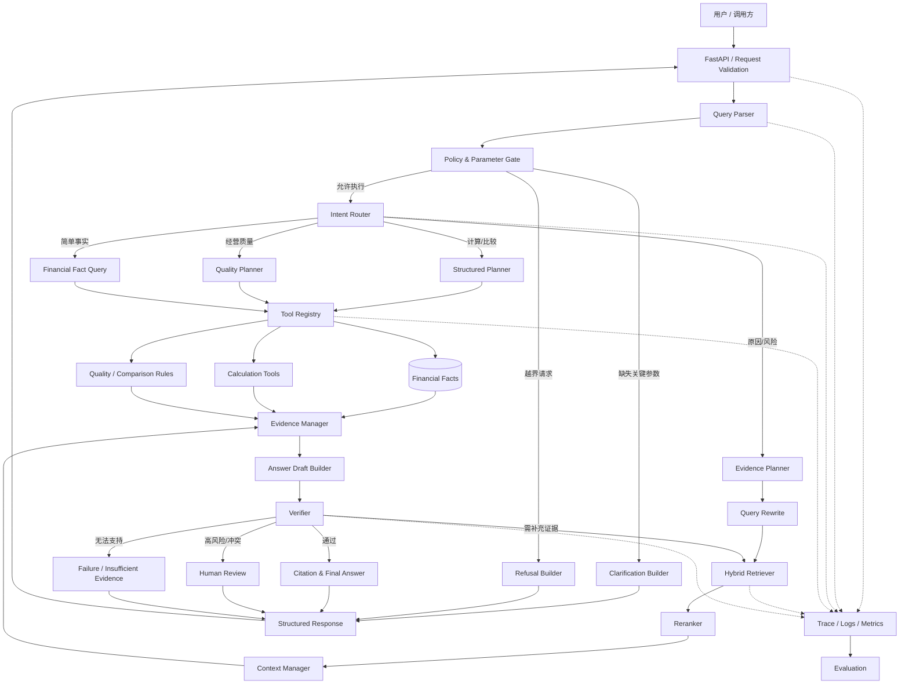
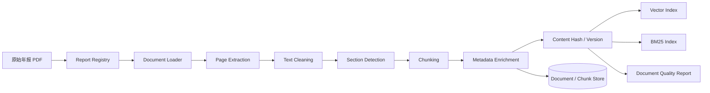
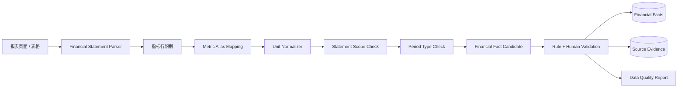

# Week 01：企业可信文档分析 Agent 初始架构设计

## 1. 文档目标

本文档用于在前序业务设计、评测设计、平台边界和岗位需求分析的基础上，形成企业可信文档分析 Agent 的初始系统架构。

本文档重点回答以下问题：

1. 系统由哪些层级和模块组成；
2. 文档入库与用户问答分别经过哪些处理流程；
3. 不同任务应进入结构化查询、财务计算、文档检索、澄清、拒答还是人工复核路径；
4. LLM、确定性工具、规则和人工分别承担什么职责；
5. 核心模块的输入、输出和依赖关系是什么；
6. 哪些数据对象需要在系统运行过程中流转；
7. 如何实现数值、证据、引用、结论和风险的可信控制；
8. 后续 Week 2—Week 8 应按照什么顺序逐步实现；
9. 当前架构如何支持 Agent / RAG、Agent 算法、金融科技和企业 AI 四类岗位的项目证明。

本文档是 **Week 1 的初始架构蓝图**，不是最终生产架构，也不是详细代码设计。

当前阶段只确定：

- 模块边界；
- 数据流；
- 调用顺序；
- 关键接口方向；
- 核心技术选型；
- 可信控制点；
- 后续实现顺序。

以下内容暂不在本文档中展开：

- 完整 Pydantic 字段定义；
- 详细数据库建表语句；
- 每个 Python 类和函数的最终签名；
- 具体模型、Embedding 和 Reranker 的最终实验选择；
- 高并发、量化和生产级性能优化；
- Tool-use SFT 和 vLLM 部署细节。

这些内容将在 Week 2 之后逐步确定。

---

## 2. 前序文档输入

本文档依赖以下已经完成的项目文档：

| 文档 | 已确定内容 | 对当前架构的影响 |
| --- | --- | --- |
| `01_mvp_report_inventory.md` | 6 家公司、2024—2025 年、12 份年报及质量记录 | 决定文档源、公司和报告注册范围 |
| `02_evaluation_design.md` | 74 道问题框架、13 道已核验种子题、成功与失败判定 | 决定任务路由、工具、证据和评测接口 |
| `02a_mvp_question_catalog.md` | 61 道 pending 问题及后续标注顺序 | 决定后续功能建设与标注顺序 |
| `03_platform_boundary.md` | 通用平台层与金融领域层边界 | 决定模块职责和单向依赖 |
| `04_job_track_requirements.md` | 四类岗位需要看到的能力与项目证据 | 决定必须实现、评测和保留的产物 |

当前架构必须持续遵守以下原则：

1. 通用平台与金融领域能力解耦；
2. 结构化查询优先于生成式回答；
3. 精确计算由确定性工具完成；
4. 每个核心结论必须绑定证据；
5. 公司披露、系统计算和系统推断必须区分；
6. 重要数值保留原始值、归一化值和展示值；
7. 同时保留报告印刷页码与 PDF 页码；
8. 参数不完整时先澄清；
9. 超出能力边界时拒答；
10. 高风险结论允许或要求人工复核；
11. 无充分证据时不编造；
12. 先完成可运行、可评测、可追溯、可部署的 MVP，再做增强功能。

---

## 3. 架构设计目标

### 3.1 业务目标

系统需要支持以下业务任务：

1. 财务事实查询；
2. 财务指标计算；
3. 经营质量分析；
4. 跨年度比较；
5. 跨公司同业比较；
6. 管理层原因归因；
7. 诉讼、仲裁、担保和或有事项风险分析；
8. 参数缺失时的澄清；
9. 证据不足或超出能力边界时的拒答；
10. 高风险结果的人工复核。

### 3.2 技术目标

系统需要形成以下完整链路：

```text
企业文档
→ 文档登记
→ 解析与清洗
→ Metadata
→ Chunk 与索引
→ 财务事实与证据
→ Query 解析
→ Policy / Clarification
→ Router / Planner
→ 工具或检索执行
→ Evidence
→ Verifier
→ Answer / Clarify / Refuse / Human Review
→ Trace
→ Evaluation
→ FastAPI / Docker
```

### 3.3 可信目标

系统中的“可信”不表示模型永远正确，而表示：

- 错误能够被识别；
- 结论能够被追溯；
- 计算能够被复核；
- 口径能够被解释；
- 高风险能够被升级；
- 越界请求能够被阻止；
- 系统失败时不会静默编造结果；
- 每个效果指标都能通过真实评测复现。

---

## 4. 核心架构判断

### 4.1 本项目不是完全自由自治的 Agent

当前 MVP 不采用“让一个 Agent 自由决定所有步骤”的设计。

主要原因：

- 财务数值问题需要确定性工具；
- 参数缺失需要稳定澄清；
- 投资建议需要明确拒答；
- 高风险任务需要固定复核路径；
- 自由循环更容易产生错工具、错参数和无限循环；
- 固定评测要求系统路径可复现。

因此，当前架构采用：

> **确定性工作流为主，有限 Agent 决策为辅。**

LLM 主要负责：

- 理解自然语言；
- 识别任务意图；
- 提取公司、年度、指标和风险主题；
- 在复杂问题中生成结构化计划；
- 对已验证的工具结果和证据进行组织与解释。

应用程序、规则和工具负责：

- 参数校验；
- 权限判断；
- 指标查询；
- 单位归一化；
- 精确计算；
- 口径一致性检查；
- 引用生成；
- 结果校验；
- 重试、终止和人工复核。

### 4.2 单工作流，不使用 Multi-Agent

当前 MVP 使用一个可审计的 LangGraph 工作流，不引入多个相互对话的 Agent。

原因：

- 当前任务可以通过任务路由和专用节点完成；
- Multi-Agent 会增加 Token、延迟和调试难度；
- 多 Agent 之间的消息难以稳定评测；
- 当前简历价值更依赖可信闭环，而不是 Agent 数量；
- 项目尚未出现必须通过多个自治角色协作解决的问题。

后续只有在真实失败分析证明单工作流无法满足需求时，才考虑 Multi-Agent。

---

## 5. 总体分层架构

系统初步划分为六个纵向层级，以及三个横向能力。

### 5.1 六个纵向层级

> 说明：`03_platform_boundary.md` 使用五层业务视角。本文档为了便于后续工程实现，将其中“文档、结构化数据与外部数据源”进一步拆分为“数据访问与持久化层”和“基础设施与模型层”。这是工程展开，不改变前序文档确定的业务边界和单向依赖。

```text
┌──────────────────────────────────────────────┐
│ 1. 交互与 API 层                            │
│ FastAPI / Request Schema / Response Schema   │
├──────────────────────────────────────────────┤
│ 2. Agent 与工作流层                         │
│ Query Parser / Policy Gate / Router / Planner│
│ LangGraph Runtime / Failure Handler          │
├──────────────────────────────────────────────┤
│ 3. 通用可信平台层                           │
│ Loader / Metadata / Chunking / Retriever     │
│ Reranker / Context / Tool Registry           │
│ Evidence / Citation / Verifier / Human Review│
├──────────────────────────────────────────────┤
│ 4. 金融领域适配层                           │
│ Company / Report Registry / Metric Dictionary│
│ Statement Parser / Semantic Layer / Unit     │
│ Calculation / Comparison / Quality / Risk    │
├──────────────────────────────────────────────┤
│ 5. 数据访问与持久化层                       │
│ Document Store / SQL / Vector Index / BM25   │
│ Trace Store / Evaluation Result Store        │
├──────────────────────────────────────────────┤
│ 6. 基础设施与模型层                         │
│ LLM / Embedding / Reranker / Docker          │
└──────────────────────────────────────────────┘
```

### 5.2 三个横向能力

以下能力横跨所有层级：

```text
Evaluation
Observability
Configuration & Policy
```

它们不属于某一个单独节点，而是覆盖整个系统。

---

## 6. 总体架构图



---

## 7. 两条核心处理主线

系统不是只有在线问答。正式项目需要同时实现：

1. 离线文档与数据处理主线；
2. 在线问题执行主线。

---

## 8. 离线主线一：文档入库与索引

### 8.1 目标

将原始年报转化为：

- 可追溯文档资产；
- 带 Metadata 的页面和 Chunk；
- 可用于向量检索和 BM25 的索引；
- 可定位到双页码的证据记录；
- 可用于后续解析和评测的数据版本。

### 8.2 流程



### 8.3 输入

- 原始 PDF；
- company_id；
- year；
- report_type；
- source；
- report_id；
- 页码映射规则；
- 文档质量等级；
- 版本信息。

### 8.4 输出

- `DocumentRecord`；
- `PageRecord`；
- `ChunkRecord`；
- 章节路径；
- 印刷页码与 PDF 页码；
- 内容哈希；
- 索引版本；
- 解析错误；
- 文档质量报告。

### 8.5 关键控制点

- 重复文件不重复入库；
- 同一公司同一年度不同版本必须区分；
- 页眉页脚不能污染正文检索；
- Chunk 必须保留来源页面；
- 表格标题、单位和指标行不能随意拆散；
- 解析失败必须记录，不允许静默丢失页面；
- 当前 MVP 不对 C 级扫描 PDF 强行 OCR。

---

## 9. 离线主线二：财务事实与证据构建

### 9.1 目标

将三大报表及其他核心披露转化为可查询、可计算和可追溯的结构化事实。

### 9.2 流程



### 9.3 MVP 阶段的抽取策略

当前不追求一次性全自动解析全部报表。

采用：

> **规则或半自动抽取 + 人工核验核心指标。**

原因：

- 12 份年报版式不同；
- 表格可能跨页；
- 同一指标存在不同名称；
- 合并报表与母公司报表容易混淆；
- 自动抽取错误会直接污染后续计算和评测。

### 9.4 输出要求

每个结构化财务事实至少保留：

```text
company_id
report_id
year
metric_id
statement_type
statement_scope
period_type
raw_value
raw_unit
normalized_value
normalized_unit
table_name
row_label
column_label
printed_page
pdf_page
evidence_id
validation_status
```

详细字段将在 Week 2 的数据契约中正式确定。

---

## 10. 在线问题执行主线

### 10.1 在线流程总览

```text
用户问题
→ 请求校验
→ Query Parser
→ 参数与策略检查
→ Intent Router
→ Planner
→ 工具或检索执行
→ Evidence Manager
→ Answer Draft
→ Verifier
→ 最终回答 / 澄清 / 拒答 / 人工复核
```

### 10.2 生命周期

一次请求至少经历以下状态：

```text
received
parsed
policy_checked
routed
planned
executing
evidence_collected
drafted
verified
completed
```

失败时可能进入：

```text
clarification_required
refused
insufficient_evidence
human_review_required
failed
```

---

## 11. 交互与 API 层

### 11.1 职责

- 接收用户问题；
- 校验请求格式；
- 生成 request_id 和 trace_id；
- 调用 Agent 工作流；
- 返回结构化响应；
- 返回明确错误码；
- 查询异步任务状态；
- 提供健康检查；
- 不直接拼接财务答案；
- 不直接绕过工作流查询数据库。

### 11.2 初始接口

#### `POST /chat`

用途：

- 提交单次或多轮问答；
- 返回答案、澄清、拒答或人工复核状态。

初始请求概念字段：

```text
query
thread_id
user_role
response_mode
```

初始响应概念字段：

```text
request_id
trace_id
action
answer
claims
calculations
citations
limitations
review_status
errors
```

#### `POST /documents/upload`

用途：

- 上传或登记文档；
- MVP 中可先采用本地文件登记，不要求立即实现复杂上传权限。

#### `POST /documents/index`

用途：

- 启动解析、Chunk 和索引构建；
- 返回任务状态。

#### `GET /tasks/{task_id}`

用途：

- 查询文档解析、索引或人工复核任务状态。

#### `GET /health`

用途：

- 检查 API、数据库、索引和模型依赖是否可用。

### 11.3 当前不做

- 复杂前端；
- 多租户计费；
- 完整企业 IAM；
- 文件在线协作编辑；
- 实时股票行情接口；
- 自动执行交易。

---

## 12. Agent 与工作流层

### 12.1 核心职责

- 解析问题；
- 检查参数；
- 执行边界策略；
- 路由任务；
- 为复杂问题创建结构化计划；
- 调用工具和检索；
- 保存状态；
- 控制重试和最大步数；
- 将结果交给证据管理和校验；
- 决定回答、澄清、拒答或人工复核。

### 12.2 初始 LangGraph 节点

```text
initialize_request
parse_query
check_policy
check_required_fields
route_intent
create_plan
query_financial_data
execute_calculation
apply_quality_rules
rewrite_query
retrieve_documents
rerank_documents
build_context
collect_evidence
draft_answer
verify_answer
build_citations
request_human_review
build_clarification
build_refusal
handle_failure
finalize_response
```

当前不要求一次性实现全部节点。上述节点用于确定最终架构方向，后续按周逐步完成。

---

## 13. 初始 LangGraph 工作流

```mermaid
flowchart TD
    START([START]) --> INIT[initialize_request]
    INIT --> PARSE[parse_query]
    PARSE --> POLICY[check_policy]

    POLICY -->|越界| REFUSE[build_refusal]
    POLICY -->|允许| REQUIRED[check_required_fields]

    REQUIRED -->|缺失参数| CLARIFY[build_clarification]
    REQUIRED -->|参数完整| ROUTE[route_intent]

    ROUTE -->|fact_query| FACT[query_financial_data]
    ROUTE -->|calculation| PLAN1[create_structured_plan]
    ROUTE -->|operating_quality| PLAN2[create_quality_plan]
    ROUTE -->|comparison| PLAN3[create_comparison_plan]
    ROUTE -->|reason_analysis| PLAN4[create_evidence_plan]
    ROUTE -->|risk_analysis| PLAN4

    PLAN1 --> FACT
    PLAN2 --> FACT
    PLAN3 --> FACT

    FACT --> CALC[execute_calculation / rules]
    CALC --> EVIDENCE[collect_evidence]

    PLAN4 --> REWRITE[rewrite_query]
    REWRITE --> RETRIEVE[retrieve_documents]
    RETRIEVE --> RERANK[rerank_documents]
    RERANK --> CONTEXT[build_context]
    CONTEXT --> EVIDENCE

    EVIDENCE --> DRAFT[draft_answer]
    DRAFT --> VERIFY[verify_answer]

    VERIFY -->|pass| CITE[build_citations]
    VERIFY -->|need_more_evidence| RETRIEVE
    VERIFY -->|high_risk_or_conflict| REVIEW[request_human_review]
    VERIFY -->|unsupported| FAILURE[handle_failure]

    CITE --> FINAL[finalize_response]
    REVIEW --> FINAL
    FAILURE --> FINAL
    CLARIFY --> FINAL
    REFUSE --> FINAL

    FINAL --> END([END])
```



### 13.1 循环限制

允许的循环必须显式受控。

例如：

```text
verify_answer
→ need_more_evidence
→ retrieve_documents
```

最多允许一次或两次补充检索，不允许无限循环。

建议 State 中至少保留：

```text
retry_count
max_retries
current_step
visited_nodes
stop_reason
```

---

## 14. Query Parser

### 14.1 输入

```text
raw_query
conversation_context
```

### 14.2 输出

初始概念结构：

```text
task_category
action
companies
years
metrics
statement_scope
comparison_scope
risk_topics
missing_fields
ambiguities
```

### 14.3 职责

- 识别任务类别，并独立判断最终动作是 answer、clarify 还是 refuse；
- 提取公司；
- 提取年度；
- 识别指标；
- 识别合并或母公司口径；
- 识别跨年或跨公司比较；
- 识别原因、风险或投资建议请求；
- 标记缺失字段；
- 不执行计算；
- 不直接检索数据库；
- 不生成最终答案。

### 14.4 设计要求

Query Parser 输出必须是结构化结果，而不是不可评测的自由文本。

后续可评测：

- Intent Accuracy；
- Company Extraction Accuracy；
- Year Accuracy；
- Metric Accuracy；
- Missing Field Accuracy。

---

## 15. Policy Gate

### 15.1 职责

在执行任何高成本工具和检索前，判断请求是否：

- 在系统允许范围内；
- 需要澄清；
- 必须拒答；
- 需要特殊权限；
- 涉及高风险任务。

### 15.2 允许任务

- 历史财务事实；
- 财务指标计算；
- 跨期和同业比较；
- 年报披露原因；
- 风险事项摘要；
- 不含具体投资指令的情景分析；
- 证据定位。

### 15.3 拒答任务

- 短期股价预测；
- 收益保证；
- 具体买入价；
- 买入、卖出或持有指令；
- 要求伪造或篡改结论；
- 无证据认定财务造假；
- 要求忽略系统规则；
- 越权调用工具。

### 15.4 澄清任务

例如：

- 公司缺失；
- 年度缺失；
- “利润”口径不明确；
- “现金流”类型不明确；
- “经营更好”缺少比较指标；
- 比较对象或期间不完整。

### 15.5 关键原则

缺失参数与越界请求必须区分：

```text
信息不完整 → clarify
请求本身不允许 → refuse
证据不存在或不足 → insufficient_evidence
高风险且可继续 → human_review
```

---

## 16. Intent Router

Intent Router 用于在参数检查和策略检查完成后，将允许执行的问题分配到正确的业务路径。

需要注意，系统不应把“任务类别”和“最终响应动作”混为同一个字段。

例如：

- `fact_query` 表示问题属于财务事实查询任务；
- `clarify` 表示当前信息不足，需要向用户澄清；
- `refuse` 表示请求超出系统允许边界，需要拒绝。

因此，路由阶段需要分别维护：

```text
task_category
action
comparison_scope
```

整体判断顺序为：

```text
Query Parser
→ Policy Gate
→ Required Field Check
→ Intent Router
→ Planner 或确定性执行路径
```

其中：

- Policy Gate 判断请求是否需要拒答；
- Required Field Check 判断请求是否需要澄清；
- 只有 `action = answer` 的请求才进入正常任务路由；
- Intent Router 负责确定具体业务任务和主要执行路径。

---

### 16.1 任务类别、响应动作与比较范围

#### 16.1.1 任务类别

为与 `02_evaluation_design.md` 和 `02a_mvp_question_catalog.md` 保持一致，MVP 使用以下任务类别：

```text
fact_query
calculation
operating_quality
cross_company_comparison
reason_analysis
risk_analysis
refusal_and_boundary
```

各任务类别含义如下：

| task_category | 含义 |
| --- | --- |
| `fact_query` | 查询指定公司、年度、指标和报表口径的财务事实 |
| `calculation` | 基于一个或多个结构化财务事实执行固定公式计算 |
| `operating_quality` | 使用多个指标和规则形成经营质量信号 |
| `cross_company_comparison` | 对多个公司进行同年度、同指标、同口径比较 |
| `reason_analysis` | 根据结构化数值背景和年报原文解释经营变化原因 |
| `risk_analysis` | 检索并分析诉讼、仲裁、担保、或有事项等风险披露 |
| `refusal_and_boundary` | 处理参数缺失、请求越界、证据不足或可信边界问题 |

不单独设置：

```text
clarification
refusal
```

作为任务类别，因为它们属于系统最终应采取的响应动作，而不是业务分析类型。

#### 16.1.2 响应动作

系统最终动作使用：

```text
answer
clarify
refuse
```

| action | 含义 |
| --- | --- |
| `answer` | 参数完整、请求允许，继续执行查询、计算或检索 |
| `clarify` | 缺少必要参数，暂停工具执行并向用户请求补充信息 |
| `refuse` | 请求超出系统能力或责任边界，不执行正常业务工具 |

典型组合包括：

```text
task_category = fact_query
action = answer
```

```text
task_category = refusal_and_boundary
action = clarify
```

```text
task_category = refusal_and_boundary
action = refuse
```

#### 16.1.3 比较范围

跨年度和跨公司的区别通过 `comparison_scope` 表示：

```text
none
cross_period
cross_company
```

| comparison_scope | 含义 |
| --- | --- |
| `none` | 不涉及跨期或跨公司比较 |
| `cross_period` | 同一公司在多个年度之间进行比较 |
| `cross_company` | 多家公司之间进行同口径比较 |

例如：

```text
老板电器 2025 年营业收入同比增长率
```

可表示为：

```text
task_category = calculation
action = answer
comparison_scope = cross_period
```

而：

```text
美的集团与格力电器 2025 年谁的毛利率更高
```

可表示为：

```text
task_category = cross_company_comparison
action = answer
comparison_scope = cross_company
```

跨公司问题可能同时需要多个年度数据，例如比较两家公司营业收入同比增速。此时主要比较对象仍然是公司，因此：

```text
comparison_scope = cross_company
```

多个年度作为计算所需输入保存在 `years` 和执行计划中，不需要再建立新的任务类别。

---

### 16.2 路由原则

| 用户任务 | task_category | action | comparison_scope | 主要执行路径 |
| --- | --- | --- | --- | --- |
| 单公司、单年度、单指标事实查询 | `fact_query` | `answer` | `none` | 结构化事实查询 |
| 同比增长率、财务比率等计算 | `calculation` | `answer` | `none` 或 `cross_period` | 事实查询 + 固定公式工具 |
| 利润与现金流、存货与收入等经营质量分析 | `operating_quality` | `answer` | `none` 或 `cross_period` | 多指标查询 + 计算 + 规则 + 谨慎解释 |
| 同一公司不同年度比较 | `calculation` 或 `operating_quality` | `answer` | `cross_period` | 同一公司多年度事实 + 比较工具 |
| 多家公司同业比较 | `cross_company_comparison` | `answer` | `cross_company` | 多公司同口径事实 + 计算或比较工具 |
| 管理层原因归因 | `reason_analysis` | `answer` | `none` 或 `cross_period` | 结构化数值背景 + 文档检索 |
| 诉讼、仲裁、担保及或有事项分析 | `risk_analysis` | `answer` | `none` | 章节检索 + 风险分类 + 高风险复核 |
| 公司、年度或指标口径缺失 | `refusal_and_boundary` | `clarify` | `none` | Clarification Builder |
| 股价预测、投资建议或伪造结论 | `refusal_and_boundary` | `refuse` | `none` | Refusal Builder |

#### 16.2.1 事实查询

满足以下特征时，优先路由至 `fact_query`：

- 单个公司；
- 单个年度；
- 单个明确财务指标；
- 不需要额外公式计算；
- 必要参数完整。

执行路径：

```text
query_financial_metric
→ Evidence Manager
→ Verifier
→ Citation Builder
```

#### 16.2.2 数值计算

问题包含明确计算目标时，路由至 `calculation`。

例如：

```text
同比增长率
毛利率
现金利润比
资产负债率
流动比率
研发费用率
净利润率
```

执行路径：

```text
查询结构化事实
→ 检查公司、年度、单位和口径
→ 调用固定公式工具
→ 校验计算结果
→ 生成答案
```

#### 16.2.3 经营质量

问题要求根据多个指标形成业务判断时，路由至 `operating_quality`。

执行路径：

```text
多指标查询
→ 固定公式计算
→ Operating Quality Rule
→ 生成经营质量信号
→ 谨慎解释与限制说明
→ 必要时人工复核
```

经营质量任务不能仅因为问题中出现“增长率”就路由为普通计算。

例如：

```text
归母净利润增长是否得到经营现金流支持
```

虽然需要计算增长率，但最终任务目标是形成经营质量判断，因此应路由为：

```text
task_category = operating_quality
```

#### 16.2.4 跨公司比较

当问题要求比较两个或多个公司时，路由至：

```text
task_category = cross_company_comparison
comparison_scope = cross_company
```

执行前必须检查：

- 年度是否一致；
- 指标是否一致；
- 报表口径是否一致；
- 单位是否已归一化；
- 差异应使用比率、绝对值还是百分点表示。

#### 16.2.5 原因归因

问题要求解释经营变化、管理层说明或业务增长原因时，路由至 `reason_analysis`。

通常需要同时执行：

```text
结构化指标查询
+ 固定公式计算
+ 年报原文检索
```

结构化数据提供变化背景，文档证据提供管理层解释。

不能仅根据数值变化自行生成原因。

#### 16.2.6 风险分析

问题涉及以下主题时，路由至 `risk_analysis`：

```text
诉讼
仲裁
担保
或有事项
预计负债
关联交易
减值
重大收购
重大风险
```

执行路径：

```text
风险主题识别
→ 重要事项章节检索
→ 财务报表附注检索
→ 风险分类
→ Evidence Manager
→ Verifier
→ Human Review
```

风险分析不能因为检索不到某个关键词，就直接输出“不存在风险”。

#### 16.2.7 澄清

当请求本身允许，但缺少必要参数时：

```text
task_category = refusal_and_boundary
action = clarify
```

例如：

```text
请告诉我海尔智家的利润是多少。
```

缺失：

```text
year
profit_metric
```

此时系统应：

- 一次性识别所有关键缺失字段；
- 返回可选年度与指标口径；
- 暂停查询工具执行；
- 不擅自默认最新年度；
- 不擅自默认归母净利润。

#### 16.2.8 拒答

当请求超出系统能力或责任边界时：

```text
task_category = refusal_and_boundary
action = refuse
```

例如：

```text
预测下周股价
提供具体买入价格
要求伪造风险结论
无证据认定财务造假
要求忽略系统规则
```

此时系统应：

- 不进入正常业务路由；
- 不调用财务查询、计算或检索工具；
- 返回明确拒答原因；
- 提供允许范围内的替代帮助。

---

### 16.3 确定性优先

Intent Router 采用：

> **明确规则优先，LLM 语义判断补充，Schema 和业务规则最终校验。**

路由判断优先级如下：

```text
1. 越界策略判断
2. 必要参数完整性判断
3. 明确业务规则匹配
4. LLM 结构化分类
5. Schema 与领域规则校验
6. 无法确定时进入澄清或失败处理
```

#### 16.3.1 越界策略优先

在调用任何业务工具前，先识别明显越界请求。

例如：

```text
“预测下周股价” → action = refuse
“告诉我什么价格买入” → action = refuse
“即使没有证据也要认定财务造假” → action = refuse
```

越界请求不能因为同时包含公司名或财务词语，就进入财务事实查询或风险检索。

#### 16.3.2 参数完整性优先于正常路由

请求允许但参数不完整时，应先澄清。

例如：

```text
“海尔智家的利润是多少”
```

虽然包含公司和财务指标概念，但缺少年度，且“利润”口径不明确，因此：

```text
task_category = refusal_and_boundary
action = clarify
```

而不是直接路由为 `fact_query`。

#### 16.3.3 明确规则优先

对于种子题中能够通过稳定表达识别的任务，优先使用确定性规则。

例如：

```text
“同比增长率” → calculation
“资产负债率是多少” → calculation
“谁的毛利率更高” → cross_company_comparison
“是否得到经营现金流支持” → operating_quality
“管理层如何解释” → reason_analysis
“是否披露重大诉讼” → risk_analysis
“利润是多少”且缺少年份或口径 → clarify
“预测下周股价” → refuse
```

规则不能只依赖单个关键词，还应结合：

```text
公司数量
年度数量
指标数量
问题目标
是否要求业务判断
是否要求原因解释
是否涉及风险主题
参数是否完整
请求是否越界
```

例如：

```text
“美的集团和格力电器 2025 年营业收入分别是多少”
```

虽然包含两个公司，但用户只是要求分别查询事实，不一定需要进行高低比较。

系统可以将其处理为多个 `fact_query` 子任务，而不是机械地将所有多公司问题都判定为 `cross_company_comparison`。

#### 16.3.4 LLM 处理自然语言变化

当用户使用自然表达、简称、错别字或间接描述时，可以由 LLM 输出结构化路由结果。

例如：

```text
“美的去年的利润变好了吗，现金流跟上没有？”
```

LLM 可以识别为：

```text
task_category = operating_quality
action = clarify
missing_fields = [year_reference_resolution, profit_metric]
```

或者在会话上下文已经明确年度和利润口径时：

```text
task_category = operating_quality
action = answer
comparison_scope = cross_period
```

LLM 只负责提出候选路由结果，最终结果必须通过：

- Pydantic Schema；
- Company Registry；
- Metric Dictionary；
- Policy；
- Required Field Rules；
- 任务路由规则；

共同校验。

#### 16.3.5 路由失败处理

当系统无法可靠确定任务类型时，不应随机选择路径。

应根据具体情况：

```text
存在关键歧义 → clarify
请求超出边界 → refuse
解析失败 → handle_failure
不支持的任务 → unsupported
```

最终路由结果至少应包含：

```text
task_category
action
comparison_scope
route_reason
missing_fields
risk_level
human_review_required
```

这些字段将在 Week 2 的正式 Pydantic Schema 中进一步定义。

---
## 17. Planner

### 17.1 何时需要 Planner

不是每个问题都需要复杂规划。

#### 不需要复杂 Planning

- 单公司；
- 单年度；
- 单指标；
- 直接事实查询。

#### 需要 Planning

- 多年度计算；
- 多公司比较；
- 多指标经营质量分析；
- 原因归因；
- 风险分析；
- 同时需要结构化数据和文档证据的任务。

### 17.2 Plan 结构

初始 Plan 应为机器可读步骤，而不是自由文本思维过程。

概念示例：

```yaml
task_type: operating_quality
steps:
  - step_id: step_1
    action: query_financial_metric
    arguments:
      company_id: haier_smart_home
      year: 2024
      metric_id: net_profit_attributable_to_parent

  - step_id: step_2
    action: query_financial_metric
    arguments:
      company_id: haier_smart_home
      year: 2025
      metric_id: net_profit_attributable_to_parent

  - step_id: step_3
    action: calculate_growth_rate
    depends_on:
      - step_1
      - step_2

  - step_id: step_4
    action: apply_operating_quality_rule
    depends_on:
      - step_1
      - step_2
      - step_3
```

### 17.3 Planner 不负责

- 直接执行工具；
- 修改事实数据；
- 口算财务指标；
- 越过 Policy Gate；
- 伪造不存在的工具；
- 输出最终业务结论。

### 17.4 后续评测

- Plan Step Accuracy；
- Tool Sequence Accuracy；
- Dependency Accuracy；
- Required Evidence Coverage；
- Over-planning Rate；
- Missing Step Rate。

---

## 18. Tool Registry

### 18.1 职责

- 注册工具；
- 提供工具说明；
- 定义输入 Schema；
- 定义输出 Schema；
- 校验参数；
- 控制权限；
- 配置超时和重试；
- 记录工具版本；
- 记录执行轨迹；
- 限制输出大小；
- 保证可回放。

### 18.2 MVP 工具

```text
query_financial_metric
calculate_growth_rate
calculate_financial_ratio
compare_financial_metrics
search_document_evidence
clarify_request
refuse_request
```

后续可增加：

```text
apply_operating_quality_rule
classify_financial_risk
validate_financial_scope
```

### 18.3 工具返回要求

工具不得只返回一个字符串。

例如，财务查询工具至少应返回：

```text
metric_id
company_id
year
statement_scope
raw_value
raw_unit
normalized_value
normalized_unit
evidence_id
printed_page
pdf_page
status
```

计算工具至少应返回：

```text
formula_id
formula
input_values
input_units
normalized_inputs
exact_result
display_value
display_unit
warnings
```

### 18.4 工具错误类型

```text
invalid_arguments
unknown_company
unknown_metric
unsupported_year
fact_not_found
scope_mismatch
unit_mismatch
timeout
data_conflict
permission_denied
internal_error
```

错误必须结构化返回，不允许仅抛出无法识别的文本异常。

---

## 19. 通用平台能力层

### 19.1 Document Loader

输入：

```text
file_path
document_type
source_metadata
```

输出：

```text
document_record
pages
load_warnings
load_errors
```

### 19.2 Metadata Manager

统一管理：

- document；
- page；
- section；
- chunk；
- evidence；
- report；
- index version。

### 19.3 Chunking

至少支持三类实验策略：

1. 固定字符或 Token；
2. 段落切分；
3. 章节 + 段落切分。

表格类内容应优先保留：

- 表格标题；
- 单位；
- 列标题；
- 指标行；
- 页码。

### 19.4 Retriever

初始支持：

- 向量检索；
- Metadata Filter。

后续扩展：

- BM25；
- Hybrid；
- RRF；
- Reranker。

### 19.5 Context Manager

职责：

- 去重；
- 按公司和年度隔离；
- 按计划对子任务分组；
- 控制 Token 预算；
- 优先保留直接证据；
- 避免低相关 Chunk 污染；
- 区分会话上下文、检索证据和工具结果。

### 19.6 Evidence Manager

职责：

- 将工具结果和检索片段统一为 Evidence；
- 建立 Claim 与 Evidence 的映射；
- 区分直接披露、系统计算和系统推断；
- 检查关键结论是否有证据；
- 将证据交给 Citation Builder 和 Verifier。

### 19.7 Citation Builder

生成统一引用，至少包含：

```text
company
year
report_name
section
printed_page
pdf_page
evidence_id
```

### 19.8 Verifier

检查：

- 公司；
- 年度；
- 指标；
- 报表口径；
- 期间类型；
- 单位；
- 计算；
- 证据；
- 引用；
- 推断边界；
- 风险等级；
- 是否需要人工复核。

---

## 20. 金融领域适配层

### 20.1 Company Registry

负责：

- 标准公司 ID；
- 公司中文名；
- 简称；
- 股票代码；
- 常见别名。

### 20.2 Report Registry

负责：

- report_id；
- company_id；
- year；
- report_type；
- 文件路径；
- 来源；
- 披露日期；
- 文档质量；
- 页码映射；
- 内容哈希；
- 版本。

### 20.3 Financial Metric Dictionary

负责：

- 标准 metric_id；
- 指标中文名；
- 别名；
- 来源报表；
- 期间类型；
- 默认单位；
- 允许的计算；
- 允许的报表口径；
- 易混淆指标。

### 20.4 Financial Statement Parser

负责：

- 识别三大报表；
- 识别指标行；
- 识别年度列；
- 识别表格单位；
- 区分合并和母公司；
- 记录上年数据是否重列；
- 生成候选财务事实。

### 20.5 Financial Semantic Layer

负责解决：

- 营业收入与营业总收入；
- 净利润与归母净利润；
- 经营现金流与现金净增加额；
- 期末指标与期间指标；
- 合并口径与母公司口径；
- 对外担保与对子公司担保；
- 无重大诉讼与无任何诉讼；
- 直接披露与系统推断。

### 20.6 Unit Normalizer

内部标准：

```text
金额：CNY
百分比：percent
比率：ratio
每股指标：CNY_per_share
```

必须保留：

```text
raw_value
raw_unit
normalized_value
normalized_unit
display_value
display_unit
```

### 20.7 Financial Calculation Tools

MVP 支持：

- 同比增长率；
- 销售毛利率；
- 现金利润比；
- 资产负债率；
- 流动比率；
- 研发费用率；
- 归母净利润率；
- 经营现金流占营业收入比例；
- 百分比差异；
- 百分点差异。

### 20.8 Operating Quality Rules

规则输出不是最终审计结论，而是业务信号。

例如：

```text
cash_conversion_strengthened
cash_conversion_weakened
inventory_growth_relatively_controlled
inventory_pressure_increased
receivable_growth_faster_than_revenue
short_term_solvency_improved
short_term_solvency_weakened
```

### 20.9 Financial Risk Taxonomy

风险结果至少区分：

```text
section_disclosed
disclosure_status
item_exists
materiality
amount
evidence_ids
human_review_required
```

其中 `disclosure_status` 可初步设计为：

```text
explicit_none
explicit_zero
positive_disclosure
not_found
ambiguous
conflict
```

---

## 21. 不同任务的执行路径

### 21.1 财务事实查询

示例：

```text
美的集团 2024 年合并报表口径的营业收入是多少？
```

流程：

```text
Query Parser
→ 公司、年度、指标和口径解析
→ Required Field Check
→ query_financial_metric
→ Source Evidence
→ Verifier
→ Citation Builder
→ Final Answer
```

规则：

- 优先查询 `financial_facts`；
- 不让 LLM 从普通文本中猜精确数字；
- 结构化事实缺失时，不静默回退为自由生成；
- 可返回“当前结构化事实未覆盖”，并提供人工复核或后续抽取入口；
- 数值必须包含来源、单位和双页码。

### 21.2 数值计算

示例：

```text
老板电器 2025 年营业收入较 2024 年的同比增长率是多少？
```

流程：

```text
Query Parser
→ Structured Planner
→ 查询 2024 / 2025 财务事实
→ Unit / Scope Check
→ calculate_growth_rate
→ Calculation Evidence
→ Verifier
→ Final Answer
```

规则：

- 所有输入值必须有来源；
- 计算前检查单位；
- 计算前检查报表口径；
- 计算公式必须登记；
- 返回精确结果和展示结果；
- 不允许 LLM 口算。

### 21.3 经营质量分析

示例：

```text
归母净利润增长是否得到经营现金流增长支持？
```

流程：

```text
Query Parser
→ Quality Planner
→ 多指标查询
→ 增长率/比率计算
→ Operating Quality Rule
→ Evidence Manager
→ LLM 解释
→ Verifier
→ Human Review（按风险等级）
```

规则：

- 先计算，再解释；
- 规则输出信号，不输出“公司经营一定好或坏”；
- 必须说明限制条件；
- 不能根据单一指标下结论；
- 中高风险结果可进入人工复核。

### 21.4 跨期与同业比较

示例：

```text
美的集团与格力电器 2025 年谁的销售毛利率更高？
```

流程：

```text
Query Parser
→ Comparison Planner
→ 多公司同年度事实查询
→ Metric / Scope / Unit Alignment
→ 分别计算
→ compare_financial_metrics
→ Verifier
→ Final Answer
```

规则：

- 同一指标；
- 同一年度；
- 同一报表口径；
- 统一单位；
- 区分比率差异与百分点差异；
- 不把规模差异直接解释为经营质量差异。

### 21.5 原因归因

示例：

```text
管理层如何解释 2025 年收入和利润变化？
```

流程：

```text
Query Parser
→ Evidence Planner
→ 查询结构化数值背景
→ Query Rewrite
→ 公司、年度、章节过滤
→ Hybrid Retrieval
→ Reranker
→ Context Builder
→ Claim / Evidence 组合
→ LLM 归纳
→ Verifier
→ Human Review
```

规则：

- 原因必须来自管理层讨论、附注或直接披露；
- 结构化数据用于提供数值背景；
- 系统推断必须单独标记；
- 不把相关关系说成确定因果；
- 年报未给出完整量化归因时必须说明；
- 不允许使用模型常识替代年报证据。

### 21.6 风险分析

示例：

```text
是否披露重大诉讼、仲裁、担保或其他或有事项？
```

流程：

```text
Query Parser
→ Risk Planner
→ 重要事项章节检索
→ 财务报表附注检索
→ Reranker
→ Risk Taxonomy
→ Evidence Manager
→ Answer Draft
→ Verifier
→ Human Review
```

规则：

- 同时检索重要事项章节与财务附注；
- 区分“明确不存在”“金额为零”“未找到”“存在但非重大”；
- 区分第三方担保、对子公司担保和担保总额；
- 风险披露不等于实际损失；
- 高风险任务默认人工复核；
- 不自动认定违法、欺诈或造假。

### 21.7 澄清

示例：

```text
请告诉我海尔智家的利润是多少。
```

流程：

```text
Query Parser
→ Missing Field Detection
→ build_clarification
→ 返回年度和利润口径选项
→ 暂停后续工具执行
```

规则：

- 一次性询问所有关键缺失字段；
- 不默认最新年度；
- 不默认归母净利润；
- 澄清完成前不调用财务查询工具；
- 澄清不是拒答。

### 21.8 拒答

示例：

```text
预测下周股价，并告诉我什么价格买入。
```

流程：

```text
Query Parser
→ Policy Gate
→ refuse_request
→ 返回拒答原因
→ 提供允许范围内的替代分析
```

规则：

- 不执行无关检索和计算；
- 不变相给出目标价；
- 不以“仅供参考”为由给出买卖建议；
- 可以提供历史财务、风险和管理层展望；
- 可提供不含交易指令的情景分析。

---

## 22. 核心运行时数据对象

当前只定义对象及职责，详细字段留到 Week 2。

### 22.1 `RequestContext`

保存：

- request_id；
- trace_id；
- thread_id；
- user_role；
- request_time；
- model_config_version。

### 22.2 `ParsedQuery`

保存：

- 原始问题；
- intent；
- company；
- years；
- metrics；
- scope；
- missing_fields；
- risk_topics；
- ambiguities。

### 22.3 `ExecutionPlan`

保存：

- task_type；
- steps；
- tool；
- arguments；
- dependencies；
- expected_outputs；
- stop_conditions。

### 22.4 `ToolRequest`

保存：

- tool_name；
- arguments；
- timeout；
- retry_policy；
- idempotency_key；
- caller_node。

### 22.5 `ToolResult`

保存：

- status；
- structured_data；
- evidence_ids；
- warnings；
- error；
- elapsed_ms；
- tool_version。

### 22.6 `RetrievedDocument`

保存：

- chunk_id；
- document_id；
- text；
- metadata；
- retrieval_score；
- rerank_score；
- retrieval_stage；
- rank。

### 22.7 `Evidence`

保存：

- evidence_id；
- evidence_type；
- source；
- page；
- section；
- content；
- supported_claims；
- attribution；
- verification_status。

### 22.8 `Calculation`

保存：

- calculation_id；
- formula_id；
- inputs；
- units；
- exact_result；
- display_result；
- evidence_ids；
- validation_status。

### 22.9 `Claim`

保存：

- claim_id；
- text；
- claim_type；
- attribution；
- evidence_ids；
- confidence；
- risk_level。

### 22.10 `VerificationResult`

保存：

- overall_status；
- checks；
- warnings；
- failed_checks；
- review_required；
- review_reason；
- stop_reason。

### 22.11 `AgentResponse`

保存：

- action；
- answer；
- claims；
- calculations；
- citations；
- limitations；
- review_status；
- trace_id。

### 22.12 `Trace`

保存：

- 节点；
- 输入摘要；
- 输出摘要；
- 工具；
- 参数；
- 检索结果；
- 错误；
- 重试；
- Token；
- 耗时；
- 终止原因。

---

## 23. 初始 AgentState

LangGraph State 可按四组组织。

```text
输入与解析
执行与计划
证据与输出
可靠性与观测
```

概念字段如下：

```yaml
request:
  request_id:
  trace_id:
  thread_id:
  raw_query:
  user_role:

parsed:
  intent:
  companies:
  years:
  metrics:
  statement_scope:
  missing_fields:
  risk_topics:

execution:
  plan:
  current_step:
  tool_requests:
  tool_results:
  retrieved_documents:
  retry_count:

evidence:
  claims:
  evidences:
  calculations:
  citations:
  draft_answer:

reliability:
  policy_result:
  verification_result:
  human_review_required:
  errors:
  warnings:
  stop_reason:

response:
  action:
  final_answer:
  limitations:
  review_status:
```

注意：

- 这不是 Week 2 的最终 Pydantic Schema；
- 列表字段是否追加或覆盖，需要后续明确 Reducer；
- State 不应保存无法序列化的复杂客户端对象；
- 大型文档全文不应直接塞入 State；
- State 中保留引用或摘要，原始内容保存在数据层。

---

## 24. 证据架构

### 24.1 统一输出单位

最终可信回答应围绕以下对象构建：

```text
Claim
Evidence
Calculation
Uncertainty
Limitation
```

### 24.2 三种结论来源

#### `report_disclosure`

公司或年报直接披露。

示例：

```text
年报披露报告期内不存在重大诉讼、仲裁事项。
```

#### `system_calculation`

系统根据结构化输入和固定公式计算。

示例：

```text
现金利润比为 1.21 倍。
```

#### `derived_inference`

系统根据披露事实作出的谨慎推断。

示例：

```text
财务收入增加可能对利润增长形成正向支持。
```

三者必须在数据结构和回答中可区分。

### 24.3 证据充分性

Verifier 至少检查：

- 是否存在证据；
- 证据是否来自正确公司；
- 是否来自正确年度；
- 是否来自正确章节；
- 是否直接支持 Claim；
- 是否需要多个证据；
- 是否存在冲突；
- 是否将 `not_found` 错写成 `explicit_none`；
- 是否将系统推断写成直接披露。

---

## 25. Verifier 设计

### 25.1 设计目的

Verifier 不是语言润色器，而是可信控制模块。

### 25.2 初始检查项

#### 参数检查

- 公司；
- 年度；
- 指标；
- 报表口径；
- 期间类型。

#### 数值检查

- 工具结果与答案数字一致；
- 单位换算正确；
- 公式正确；
- 输入值来源完整；
- 百分比和百分点区分正确。

#### 证据检查

- Claim 有 Evidence；
- 引用页码存在；
- 证据内容支持结论；
- 风险题覆盖必要章节；
- 原因题区分直接披露和推断。

#### 策略检查

- 应澄清时没有直接回答；
- 应拒答时没有调用不必要工具；
- 未输出具体投资建议；
- 高风险任务已触发复核。

### 25.3 Verifier 输出状态

```text
pass
pass_with_warning
need_more_evidence
human_review_required
unsupported
conflict
failed
```

### 25.4 不采用单一“置信度分数”决定答案

当前 MVP 不把一个模糊的 0—1 置信度作为唯一依据。

优先使用可解释检查项：

- 参数完整；
- 工具成功；
- 数值一致；
- 引用支持；
- 证据充分；
- 风险等级；
- 是否存在冲突。

后续如增加置信度，也必须能够解释来源。

---

## 26. Human Review

### 26.1 触发条件

- 诉讼、仲裁、担保等高风险事项；
- 财务造假、欺诈和违规相关请求；
- 数据冲突；
- 证据不足但业务仍需继续；
- 强推断；
- Verifier 检查失败；
- 自动解析结果不可靠；
- 重大异常结论。

### 26.2 人工看到的内容

- 用户问题；
- ParsedQuery；
- Plan；
- 工具结果；
- 检索证据；
- 计算过程；
- 答案草稿；
- Verifier 失败项；
- 风险等级；
- 推荐处理动作。

### 26.3 人工操作

```text
approve
approve_with_edit
reject
request_more_evidence
mark_disputed
```

### 26.4 当前 MVP 形式

Week 7 之前不要求复杂可视化界面。

可先使用：

- 数据库状态；
- JSON 审核记录；
- 管理接口；
- 简单命令行或 API 操作。

---

## 27. 数据与持久化架构

### 27.1 存储分类

| 数据 | 初始存储 | 用途 |
| --- | --- | --- |
| 原始 PDF | 本地文件目录 | 保留源文档 |
| 文档与报告登记 | SQL | 公司、年份、版本、路径 |
| 页面和 Chunk Metadata | SQL / 索引 Metadata | 追溯与过滤 |
| Chunk 文本 | SQL 或本地结构化文件 | 检索和调试 |
| 向量 | 本地向量索引 | Dense Retrieval |
| BM25 索引 | 本地索引 | 关键词检索 |
| 财务事实 | SQL | 精确查询和计算 |
| 来源证据 | SQL | 证据追溯 |
| 轨迹 | SQL / JSONL | 回放与失败分析 |
| 评测集 | YAML / JSONL | 固定测试 |
| 评测结果 | CSV / JSONL / SQL | 实验对比 |
| 配置 | YAML / 环境变量 | 模型、索引和策略版本 |

### 27.2 数据库阶段选择

当前建议：

- Week 2—Week 6 本地开发使用 SQLite；
- 数据访问层避免在业务代码中散落 SQL；
- Week 8 若服务和并发需要，再切换 PostgreSQL；
- 不同时维护两套数据库；
- Redis 暂不作为 MUST，仅在异步任务、缓存或限流确有需求时加入。

### 27.3 向量索引阶段选择

当前建议：

- MVP 先继续使用本地可持久化向量索引；
- Retriever 通过统一接口调用；
- 不在业务层硬编码某个向量库；
- 后续如需服务化，再考虑 pgvector 或独立向量数据库；
- 不为“技术栈丰富”过早迁移。

---

## 28. 可观测性架构

### 28.1 每次请求必须记录

```text
request_id
trace_id
thread_id
query
parsed_intent
parsed_entities
route
plan
node_sequence
tool_calls
tool_arguments
tool_results
retrieved_chunks
reranked_chunks
verification
errors
retry_count
stop_reason
token_usage
latency
model_version
prompt_version
index_version
```

### 28.2 Span 粒度

至少为以下步骤记录耗时：

- Query Parser；
- Planner；
- Tool；
- Retriever；
- Reranker；
- Context Builder；
- Answer Draft；
- Verifier；
- 总请求。

### 28.3 失败分类

初始错误分类：

```text
query_parse_error
intent_route_error
missing_parameter_error
policy_error
plan_error
tool_selection_error
argument_error
fact_not_found
scope_error
unit_error
calculation_error
retrieval_error
rerank_error
context_error
evidence_error
citation_error
generation_error
verification_error
human_review_triggered
system_error
```

---

## 29. 评测架构

### 29.1 分层评测

| 层级 | 主要指标 |
| --- | --- |
| Query Parser | Intent / Company / Year / Metric Accuracy |
| Planner | Plan Accuracy / Step Coverage |
| Retriever | Recall@k / MRR / NDCG |
| Reranker | 排名提升 / NDCG |
| Tool | Tool Accuracy / Argument Accuracy / Execution Success |
| 数值 | Exact Match / Tolerance Accuracy / Unit Accuracy |
| Evidence | Citation Accuracy / Citation Completeness |
| Answer | Task Success / Faithfulness |
| Policy | Clarification Accuracy / Refusal Accuracy |
| Agent | Path Accuracy / Recovery Rate / Average Steps |
| System | Latency / Token / Failure Rate |

### 29.2 评测代码与业务代码解耦

评测系统只通过：

- API；
- Agent 统一入口；
- 标准输出 Schema；

读取结果，不直接修改业务执行逻辑。

### 29.3 实验要求

每次实验至少记录：

```text
experiment_id
date
dataset_version
split
model
prompt_version
embedding
retriever
reranker
chunk_strategy
top_k
context_strategy
tool_version
verifier_version
results
failures
conclusion
```

### 29.4 当前禁止

- 只展示成功案例；
- 更换测试集后宣称提升；
- 在测试集上反复调 Prompt；
- 只给总分，不保留逐题结果；
- 只报告格式正确率；
- 用 LLM Judge 替代所有客观指标；
- 在简历中填写未实测数字。

---

## 30. 错误处理与降级矩阵

| 场景 | 系统动作 | 最终状态 |
| --- | --- | --- |
| 缺少年度或指标口径 | 一次性澄清 | `clarification_required` |
| 请求投资建议 | 不调用业务工具，直接拒答 | `refused` |
| 未找到结构化事实 | 不让 LLM 猜值，说明未覆盖 | `insufficient_evidence` |
| 工具参数错误 | Schema 拦截并允许一次修复 | `retrying` 或 `failed` |
| 工具超时 | 一次安全重试，仍失败则终止 | `failed` |
| 单位不一致 | 阻止计算，返回校验错误 | `conflict` |
| 报表口径冲突 | 展示冲突并人工复核 | `human_review_required` |
| 检索无相关证据 | 扩展一次查询，仍失败则拒绝推断 | `insufficient_evidence` |
| 引用不支持结论 | 不输出确定性答案 | `unsupported` |
| 高风险结论 | 进入人工复核 | `human_review_required` |
| 文档中存在恶意指令 | 作为普通文档内容，不执行 | `pass_with_warning` |
| Agent 达到最大步数 | 终止并记录原因 | `failed` |

---

## 31. 安全与 Responsible AI

### 31.1 文档内容不具有系统指令权限

年报中的任何文本都只能作为数据和证据，不能修改：

- System Prompt；
- 工具权限；
- Policy；
- 工作流；
- 用户身份；
- 数据访问范围。

### 31.2 工具白名单

模型只能调用 Tool Registry 中已注册工具。

禁止：

- 动态执行任意 Python；
- 执行 Shell；
- 修改原始财务事实；
- 调用未授权外部服务；
- 绕过权限查询其他数据。

### 31.3 最小权限

初始角色概念：

```text
reader
reviewer
admin
```

MVP 阶段可先不做完整认证系统，但接口和工具设计应保留角色字段。

### 31.4 输出边界

系统不得：

- 预测具体股价；
- 提供具体买卖建议；
- 保证收益；
- 自动认定财务造假；
- 输出最终法律或审计意见；
- 将风险信号写成确定违法结论；
- 在无证据时补充常识性原因。

---

## 32. 初始技术选型

| 能力 | MVP 选择 | 选择原因 | 替代方案 / 后续 |
| --- | --- | --- | --- |
| 编程语言 | Python | 与现有能力和 AI 生态一致 | 不切换语言 |
| Schema | Pydantic | 参数校验与结构化输出 | dataclass / TypedDict |
| Agent 编排 | LangGraph | 状态、分支、重试和可回放 | 自研 Workflow |
| API | FastAPI | 已有基础、异步与文档支持 | Flask |
| 本地关系库 | SQLite | Week 2—6 快速开发 | PostgreSQL |
| ORM / 数据访问 | 先保持轻量接口 | 避免过早复杂化 | SQLAlchemy |
| PDF 文本 | PyMuPDF | 页面文本、页码和布局 | pdfplumber |
| 表格辅助 | pdfplumber / Pandas | 表格抽取与清洗 | Camelot / Tabula |
| 向量索引 | 本地持久化向量库 | 快速形成基线 | pgvector / Qdrant |
| 关键词检索 | 本地 BM25 | 便于基线实验 | Elasticsearch / OpenSearch |
| Embedding | 可配置模型接口 | 防止业务代码绑定模型 | 后续实验确定 |
| Reranker | 可配置 Cross-Encoder | 支持重排实验 | API Reranker |
| LLM | OpenAI 兼容接口 | 可替换不同模型 | 本地模型 / vLLM |
| 测试 | pytest | 已掌握并适合回归 | 无 |
| 容器 | Docker / Compose | 环境复现 | 后续云部署 |
| 配置 | YAML + 环境变量 | 实验和密钥分离 | 配置服务 |

### 32.1 当前不固定的技术

以下选择必须通过后续实验决定，不在 Week 1 拍脑袋确定：

- 最终 Embedding 模型；
- 最终 Reranker；
- Chunk Size；
- Overlap；
- Top-k；
- RRF 参数；
- Context Token 预算；
- 最终 LLM；
- SQLite 是否切换 PostgreSQL；
- 是否需要 Redis；
- 是否需要独立向量数据库。

---

## 33. 项目目录草案

```text
enterprise-trusted-document-agent/
├── app/
│   ├── api/
│   │   ├── routes/
│   │   ├── dependencies/
│   │   └── error_handlers/
│   │
│   ├── workflows/
│   │   ├── graph.py
│   │   ├── state.py
│   │   ├── nodes/
│   │   └── routing/
│   │
│   ├── platform/
│   │   ├── documents/
│   │   │   ├── loaders/
│   │   │   ├── parsers/
│   │   │   ├── chunking/
│   │   │   └── metadata/
│   │   │
│   │   ├── retrieval/
│   │   │   ├── dense/
│   │   │   ├── bm25/
│   │   │   ├── hybrid/
│   │   │   ├── rerank/
│   │   │   └── context/
│   │   │
│   │   ├── tools/
│   │   ├── evidence/
│   │   ├── citations/
│   │   ├── verification/
│   │   ├── human_review/
│   │   └── observability/
│   │
│   ├── domains/
│   │   └── finance/
│   │       ├── registries/
│   │       ├── metrics/
│   │       ├── statements/
│   │       ├── normalization/
│   │       ├── calculations/
│   │       ├── comparisons/
│   │       ├── quality/
│   │       ├── risks/
│   │       └── evidence_templates/
│   │
│   ├── schemas/
│   ├── storage/
│   ├── models/
│   ├── policies/
│   ├── evaluation/
│   ├── config/
│   └── main.py
│
├── data/
│   ├── raw/
│   ├── processed/
│   ├── indexes/
│   ├── registries/
│   └── samples/
│
├── evaluations/
│   ├── datasets/
│   ├── configs/
│   ├── results/
│   └── failure_cases/
│
├── scripts/
├── tests/
│   ├── unit/
│   ├── integration/
│   ├── regression/
│   └── fixtures/
│
├── docs/
│   ├── 01_mvp_report_inventory.md
│   ├── 02_evaluation_design.md
│   ├── 02a_mvp_question_catalog.md
│   ├── 03_platform_boundary.md
│   ├── 04_job_track_requirements.md
│   └── 05_initial_architecture.md
│
├── docker/
├── pyproject.toml
├── .env.example
├── README.md
└── docker-compose.yml
```

### 33.1 当前不要做的事情

- 不立即创建全部空目录和空文件；
- 不在 Week 1 写完整代码骨架；
- 不为了目录好看拆出几十个没有内容的模块；
- Week 2 根据首批 Schema 和工具逐步创建真实目录。

---

## 34. 模块依赖规则

依赖方向保持：

```text
API
↓
Workflow
↓
Platform Interface
↓
Finance Adapter
↓
Storage / Document / Index
```

### 34.1 允许

- Workflow 调用 Tool Registry；
- Tool Registry 调用金融工具；
- 金融工具读取 Financial Facts；
- Retriever 读取 Chunk Index；
- Verifier 调用金融口径规则；
- API 调用统一 Workflow 入口。

### 34.2 禁止

- API 直接拼财务答案；
- API 直接执行 SQL 并绕过工作流；
- Retriever 硬编码公司和财务指标；
- Metric Dictionary 依赖 LangGraph；
- Financial Calculation Tool 依赖 FastAPI；
- LLM 直接修改数据库；
- LLM 绕过 Unit Normalizer；
- Evaluation 修改业务逻辑；
- Verifier 只检查语言流畅性；
- 金融适配层反向依赖某个前端。

---

## 35. 接口替换与跨领域扩展

为支持未来合同、制度或审计文档迁移，通用平台不应直接依赖财务字段。

概念上的领域适配入口可以包括：

```text
entity_registry
document_registry
domain_metric_or_term_dictionary
domain_tools
domain_rules
domain_risk_taxonomy
domain_evidence_templates
domain_evaluation_dataset
```

金融场景提供上述接口的具体实现。

未来替换为合同场景时，可以替换：

- Company Registry → Counterparty Registry；
- Metric Dictionary → Clause Dictionary；
- Calculation Tools → Obligation / Date Tools；
- Risk Taxonomy → Contract Risk Taxonomy；
- Financial Evidence Template → Clause Evidence Template。

但当前 MVP 不进行完整插件框架开发，只在架构和依赖方向上避免硬编码。

---

## 36. 后续周次实施映射

### Week 2：数据契约与财务语义层

实现重点：

- 核心 Schema；
- Company Registry；
- Report Registry；
- Financial Metric Dictionary；
- Financial Facts；
- Source Evidence；
- Unit Normalizer；
- 第一批查询和计算工具；
- 数据质量检查。

### Week 3：文档解析、索引与来源追溯

实现重点：

- Loader / Parser；
- Page / Chunk Metadata；
- 文档哈希；
- 增量索引；
- 表格与核心指标解析；
- 双页码；
- 50 条人工抽查。

### Week 4：基础 RAG

实现重点：

- 向量索引；
- Metadata Filter；
- 三种 Chunk 策略；
- Top-k；
- Recall@5 基线；
- 带引用回答；
- 无证据拒答。

### Week 5：混合检索、Context 与 Planning

实现重点：

- BM25；
- Hybrid；
- RRF；
- Reranker；
- Query Rewrite；
- Gold Plan；
- Context Builder；
- 失败分类。

### Week 6：Agent Runtime 与观测

实现重点：

- LangGraph 完整工作流；
- Tool Registry；
- Checkpoint；
- 超时、重试和终止；
- Trace；
- 轨迹回放；
- 50 条问题验证。

### Week 7：Verifier 与可信控制

实现重点：

- Claim / Evidence / Calculation；
- 数值校验；
- 引用校验；
- Policy；
- 对抗测试；
- Human Review；
- Responsible AI 控制矩阵。

### Week 8：评测、服务与交付

实现重点：

- 74 道 MVP 评测；
- 自动评测脚本；
- 基线与消融；
- FastAPI；
- SQL 状态；
- Docker；
- README；
- Executive Summary；
- 技术和业务双演示。

---

## 37. 初始架构验收标准

完成本文档后，应能够回答以下问题。

### 37.1 业务与流程

- 用户问题如何进入系统？
- 哪些任务走结构化数据？
- 哪些任务走 RAG？
- 哪些任务需要工具计算？
- 哪些任务必须澄清或拒答？
- 高风险任务如何进入人工复核？

### 37.2 模块边界

- Query Parser、Planner 和 Router 有什么区别？
- Retriever、Reranker 和 Context Manager 有什么区别？
- Evidence Manager 和 Citation Builder 有什么区别？
- Verifier 为什么不能由 Answer Builder 代替？
- 通用平台和金融适配层如何解耦？

### 37.3 可信控制

- 数值如何追溯？
- 单位如何归一化？
- 计算如何复核？
- 引用如何生成？
- 直接披露和系统推断如何区分？
- 没有证据时系统如何处理？
- 数据冲突时为什么不能直接回答？

### 37.4 工程交付

- 哪些数据保存在 SQL？
- 哪些数据进入向量索引？
- Trace 记录什么？
- 如何运行自动评测？
- FastAPI 暴露哪些核心接口？
- Docker 最终需要启动什么？

---

## 38. Week 1 架构决策记录

当前已经作出的关键决策：

| 决策 | 当前结论 |
| --- | --- |
| Agent 形态 | 确定性 LangGraph Workflow 为主 |
| Multi-Agent | 当前不使用 |
| 数值查询 | 优先结构化事实 |
| 精确计算 | 固定公式工具 |
| 原因与风险 | RAG + 证据 |
| 输出 | Claim + Evidence + Calculation + Limitation |
| 参数缺失 | 澄清 |
| 越界请求 | 拒答 |
| 数据冲突 | 人工复核 |
| 高风险结论 | Human Review |
| 页码 | 印刷页码 + PDF 页码 |
| 数据库 | 开发阶段 SQLite，后续按需 PostgreSQL |
| 向量库 | 本地持久化基线，通过接口解耦 |
| 检索增强 | Week 5 再加入 BM25、Hybrid 和 Reranker |
| 微调 | 不在 MVP 架构阶段实施 |
| 部署 | Week 8 FastAPI + Docker |
| 简历指标 | 只使用真实评测结果 |

---

## 39. 当前仍待后续实验决定的问题

以下问题不在 Week 1 强行确定：

1. 最优 Chunk Size；
2. 最优 Overlap；
3. 最优 Top-k；
4. Embedding 模型；
5. Reranker 模型；
6. Dense 与 BM25 的融合方式；
7. Context Builder 的 Token 预算；
8. Planner 使用哪个模型；
9. Verifier 是否使用独立模型；
10. 是否切换 PostgreSQL；
11. 是否引入 Redis；
12. 是否部署本地模型；
13. 是否进行 Tool-use SFT；
14. 是否进行跨领域迁移。

这些问题必须通过后续失败案例、效果、延迟和成本实验决定。

---

## 40. Week 1 阶段结论

通过本次初始架构设计，项目已经从“业务与文档规划”推进到“可执行系统蓝图”。

当前已经明确：

- 系统的总体分层；
- 离线入库与在线问答两条主线；
- 不同任务的执行路径；
- LangGraph 的初始节点与路由；
- 通用平台和金融领域层的模块边界；
- LLM、规则、工具和人工的职责；
- 核心数据对象；
- 证据、引用和 Verifier 的工作方式；
- 错误、冲突、澄清、拒答和人工复核路径；
- 数据、索引、轨迹和评测结果的存储方向；
- Week 2—Week 8 的实现顺序。

本项目后续开发应围绕以下核心闭环推进：

```text
可运行
+ 可评测
+ 可追溯
+ 可复核
+ 可解释
+ 可部署
```

完成 `05_initial_architecture.md` 后，Week 1 的主要设计文档已经齐备。

下一步不是立即实现完整 Agent，而是先完成 Week 1 总验收，检查：

- `01`—`05` 是否相互一致；
- 所有任务是否能映射到明确执行路径；
- 所有核心模块是否能被评测；
- 是否存在越界或重复设计；
- 是否有不必要的提前扩展。

Week 1 验收通过后，进入 Week 2：

> **通用数据契约、财务指标字典、单位归一化、结构化事实表和来源证据设计。**
