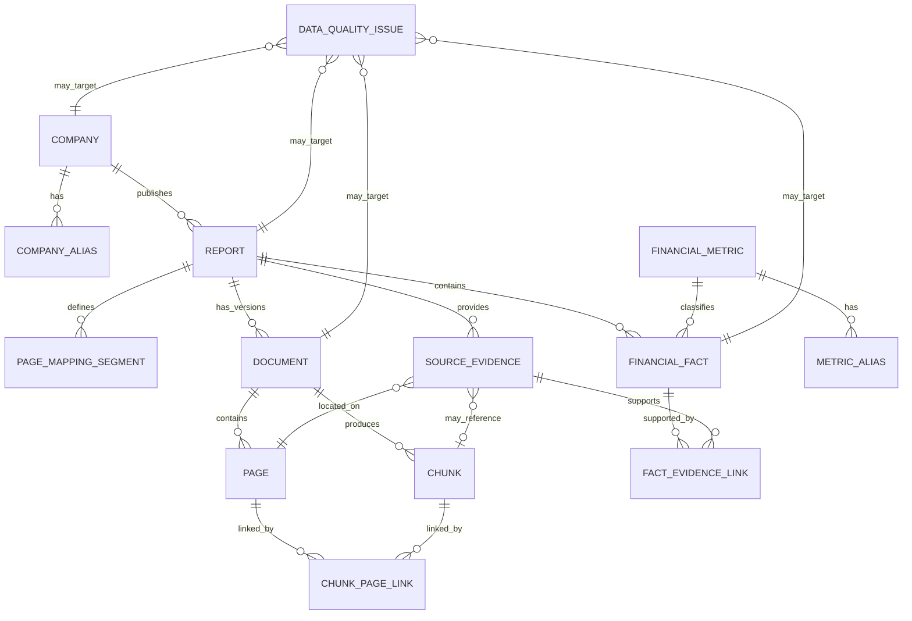

# Week 02：通用数据契约设计

## 1. 文档目标

本文档用于定义“企业可信文档分析 Agent”在 Week 2 中使用的核心数据对象、字段、关系、枚举、约束和数据质量规则。

本文档重点回答：

1. 公司、年报、原始文档、页面、Chunk、财务指标、财务事实和来源证据分别如何表示；
2. 每个对象的唯一标识是什么；
3. 对象之间如何关联；
4. 哪些字段必须保留原始值，哪些字段用于归一化和展示；
5. 如何保证每个结构化财务数值可以追溯到报告、页码、报表、指标行和年度列；
6. 如何处理合并报表与母公司报表、时点指标与期间指标、单位换算和重列数据；
7. 后续 Pydantic Schema、SQLite 表和查询工具应共同遵守什么契约；
8. 如何通过自动检查发现缺失、重复、冲突和不可追溯数据。

本文档是 Week 2 的第一份设计文档。

当前阶段只定义数据契约，不在本文档中实现：

- 完整数据库建表语句；
- SQLAlchemy ORM；
- 财务报表自动解析器；
- LangGraph 工作流；
- RAG、Embedding 和 Reranker；
- 完整查询与计算工具；
- 61 道 pending 问题的全部 Ground Truth。

这些内容将在本周后续步骤及 Week 3—Week 6 中逐步实现。

---

## 2. 本文档在 Week 2 中的位置

Week 2 的执行顺序为：

```text
数据契约
→ Company Registry
→ Report Registry
→ Financial Metric Dictionary
→ Financial Facts
→ Source Evidence
→ Unit Normalizer
→ 查询与计算工具
→ 数据质量检查
```

数据契约必须先于正式代码和数据库设计完成。

原因是：

- Pydantic Schema 需要统一字段来源；
- SQLite 表需要统一主键和外键；
- 查询工具需要统一输入和输出；
- 评测集需要映射到稳定的数据对象；
- 后续更换数据库时不能重新定义业务含义；
- 财务事实必须在进入 Agent 前完成单位、期间和口径约束。

---

## 3. 设计输入

本文档基于 Week 1 已经确定的内容：

- 6 家公司；
- 2024—2025 年；
- 12 份年度报告；
- 74 道 MVP 问题；
- 13 道已核验种子题；
- 结构化事实优先；
- 精确计算由确定性工具完成；
- 原因和风险由文档证据支持；
- 每个核心结论绑定证据；
- 保留报告印刷页码和 PDF 页码；
- 区分公司披露、系统计算和系统推断；
- 数据冲突和高风险事项进入人工复核。

---

## 4. 数据契约设计原则

### 4.1 业务含义优先于数据库实现

本契约先定义业务对象和字段含义，再决定 SQLite、PostgreSQL 或 JSONL 的具体实现。

不允许为了方便建表而丢失：

- 原始单位；
- 原始值；
- 年度列；
- 表格名称；
- 报表口径；
- 印刷页码；
- PDF 页码；
- 人工核验状态；
- 数据来源。

### 4.2 原始数据与归一化数据同时保留

任何财务数值均应保留：

```text
raw_value
raw_unit
normalized_value
normalized_unit
```

后续展示时再生成：

```text
display_value
display_unit
display_precision
```

`display_value` 不应作为精确计算输入。

### 4.3 使用 Decimal，不使用 float 保存财务数值

正式 Pydantic Schema 和计算工具应使用 `Decimal`。

禁止使用浮点数直接保存财务事实，避免二进制浮点误差影响：

- 数值精确匹配；
- 同比增长率；
- 财务比率；
- 容差评测；
- 结果复现。

JSON、YAML 或 JSONL 文件中，精确金额建议保存为字符串：

```yaml
raw_value: "407149600"
normalized_value: "407149600000"
```

### 4.4 每个事实必须可追溯

每个 `FinancialFact` 至少要能追溯到：

```text
company
report
document
statement
table
row
column
printed_page
pdf_page
evidence
```

缺少关键来源的数值只能标记为候选值，不能直接进入已验证事实表。

### 4.5 通用平台与金融领域解耦

通用对象：

```text
Document
Page
Chunk
SourceEvidence
DataQualityIssue
```

金融领域对象：

```text
Company
Report
FinancialMetric
MetricAlias
FinancialFact
FactEvidenceLink
```

通用层不应硬编码：

- 美的集团；
- 营业收入；
- 合并利润表；
- 现金利润比。

### 4.6 不静默覆盖

发现同一个事实出现多个值时，不允许直接保留最后一次写入。

系统应：

1. 保留全部候选记录；
2. 标记冲突；
3. 记录来源和版本；
4. 进入人工核验；
5. 只有通过验证的记录才可成为当前有效事实。

---

## 5. 核心对象总览

| 对象 | 层级 | 主要职责 |
| --- | --- | --- |
| `Company` | 金融领域 | 保存公司标准身份信息 |
| `CompanyAlias` | 金融领域 | 保存公司简称和别名 |
| `Report` | 金融领域 | 保存某公司某年度报告的业务信息 |
| `PageMappingSegment` | 金融领域 | 描述印刷页码与 PDF 页码映射 |
| `Document` | 通用平台 | 保存实际文件及解析状态 |
| `Page` | 通用平台 | 保存 PDF 页面及页面级元数据 |
| `Chunk` | 通用平台 | 保存用于检索的文档片段 |
| `ChunkPageLink` | 通用平台 | 保存 Chunk 与页面的多对多关系 |
| `FinancialMetric` | 金融领域 | 定义标准财务指标和业务口径 |
| `MetricAlias` | 金融领域 | 保存指标别名和匹配优先级 |
| `FinancialFact` | 金融领域 | 保存结构化财务事实 |
| `SourceEvidence` | 通用平台 | 保存支持事实或结论的原始证据 |
| `FactEvidenceLink` | 金融领域 | 建立财务事实与证据的关联 |
| `DataQualityIssue` | 通用平台 | 保存数据质量问题及处理状态 |

Week 2 后续可以增加：

```text
FormulaDefinition
RiskRule
ToolRun
Trace
HumanReviewRecord
```

这些对象不作为 Step 1 的首批实现阻塞项。

---

## 6. 对象关系



### 6.1 关系说明

```text
Company 1 → N Report
Report 1 → N Document
Document 1 → N Page
Document 1 → N Chunk
Chunk N ↔ N Page
FinancialMetric 1 → N FinancialFact
FinancialFact N ↔ N SourceEvidence
Report 1 → N SourceEvidence
```

当前 MVP 通常每个 Report 只有一个实际 PDF 文档，但契约保留多个文件版本的能力。

---

## 7. 通用命名规范

### 7.1 ID 命名

ID 统一使用小写字母、数字和下划线。

示例：

```text
company_id: midea
report_id: midea_2025
document_id: midea_2025_pdf_v1
page_id: midea_2025_pdf_v1_p0135
chunk_id: midea_2025_pdf_v1_c000421
metric_id: revenue
fact_id: fact_midea_2025_revenue_consolidated
evidence_id: ev_midea_2025_income_statement_revenue
```

### 7.2 时间字段

- 日期：`YYYY-MM-DD`
- 时间：ISO 8601
- 时区：存储时使用 UTC
- 展示时根据调用环境转换

示例：

```text
2026-07-23T08:30:00Z
```

### 7.3 空值

空值使用 `null`，不能使用：

```text
""
"未知"
"N/A"
"无"
0
```

代替真正的缺失值。

“年报明确披露为零”必须保存为数值 `0`，不能保存为 `null`。

### 7.4 布尔值

只使用：

```text
true
false
```

不使用“是”“否”作为内部字段值。

---

## 8. 核心枚举

### 8.1 `ReportType`

```text
annual_report
semiannual_report
quarterly_report
other
```

MVP 当前只使用：

```text
annual_report
```

### 8.2 `DocumentType`

```text
pdf
docx
markdown
html
other
```

MVP 当前只使用：

```text
pdf
```

### 8.3 `DocumentQualityGrade`

```text
A
B
C
```

### 8.4 `RecordStatus`

```text
draft
active
superseded
archived
```

### 8.5 `ValidationStatus`

```text
pending
verified
disputed
rejected
```

### 8.6 `IngestionStatus`

```text
registered
loading
parsed
indexed
partial
failed
```

### 8.7 `StatementType`

```text
balance_sheet
income_statement
cash_flow_statement
statement_of_changes_in_equity
financial_summary
note
management_discussion
important_events
other
```

### 8.8 `StatementScope`

```text
consolidated
parent_company
segment
group
not_applicable
unknown
```

精确财务事实不允许长期保留 `unknown`。无法确认时应保持 `pending`，不能进入已验证事实。

### 8.9 `PeriodType`

```text
instant
duration
```

- `instant`：资产负债表等时点指标；
- `duration`：利润表、现金流量表等期间指标。

### 8.10 `MetricOrigin`

```text
reported
derived
```

- `reported`：年报直接披露；
- `derived`：系统通过固定公式计算。

Week 2 的 `FinancialFact` 首批只录入 `reported` 指标。派生指标优先由计算工具实时生成。

### 8.11 `UnitCode`

```text
CNY
CNY_thousand
CNY_ten_thousand
CNY_million
CNY_hundred_million
percent
percentage_point
ratio
CNY_per_share
count
text
```

内部归一化标准：

```text
金额 → CNY
百分比 → percent
百分点差异 → percentage_point
比率 → ratio
每股指标 → CNY_per_share
```

### 8.12 `EvidenceType`

```text
financial_statement_cell
financial_summary_table
management_statement
financial_note
risk_disclosure
table
paragraph
calculation_input
other
```

### 8.13 `AttributionType`

```text
report_disclosure
management_statement
system_calculation
derived_inference
```

`SourceEvidence` 通常只保存前两类直接来源。

`system_calculation` 和 `derived_inference` 主要用于后续 Claim、Calculation 与回答层。

### 8.14 `DataQualityDimension`

```text
completeness
uniqueness
consistency
accuracy
timeliness
traceability
```

### 8.15 `Severity`

```text
info
low
medium
high
critical
```

---

## 9. `Company`

### 9.1 职责

保存企业标准身份，不保存年度财务数值。

### 9.2 字段

| 字段 | 类型 | 必填 | 约束与说明 |
| --- | --- | :---: | --- |
| `company_id` | string | 是 | 主键，小写英文 ID |
| `legal_name_cn` | string | 是 | 公司正式中文名称 |
| `short_name_cn` | string | 是 | 常用中文简称 |
| `stock_code` | string | 是 | 保留前导零 |
| `exchange` | string | 是 | `SZSE` 或 `SSE` |
| `industry` | string | 是 | MVP 为家电制造业 |
| `status` | RecordStatus | 是 | 当前应为 `active` |
| `created_at` | datetime | 是 | 创建时间 |
| `updated_at` | datetime | 是 | 更新时间 |

### 9.3 唯一性

必须唯一：

```text
company_id
(exchange, stock_code)
legal_name_cn
```

### 9.4 MVP 公司 ID

```text
midea
gree
haier_smart_home
hisense_home
robam
supor
```

---

## 10. `CompanyAlias`

### 10.1 职责

将用户自然语言中的公司写法映射到标准 `company_id`。

### 10.2 字段

| 字段 | 类型 | 必填 | 说明 |
| --- | --- | :---: | --- |
| `alias_id` | string | 是 | 主键 |
| `company_id` | string | 是 | 外键 |
| `alias` | string | 是 | 公司别名 |
| `alias_type` | string | 是 | `short_name`、`legal_name`、`stock_code`、`common_name` |
| `priority` | integer | 是 | 匹配优先级，数值越小优先级越高 |
| `status` | RecordStatus | 是 | 状态 |

### 10.3 约束

同一个别名不能映射到多个活跃公司。

发现歧义时：

```text
validation_status = disputed
```

不得静默选取公司。

---

## 11. `Report`

### 11.1 职责

表示某一家公司某一财务年度的一份业务报告。

`Report` 是金融领域对象；`Document` 是实际文件对象。

### 11.2 字段

| 字段 | 类型 | 必填 | 约束与说明 |
| --- | --- | :---: | --- |
| `report_id` | string | 是 | 主键，建议 `{company_id}_{fiscal_year}` |
| `company_id` | string | 是 | 外键 |
| `fiscal_year` | integer | 是 | MVP 为 2024 或 2025 |
| `report_type` | ReportType | 是 | 当前为 `annual_report` |
| `title` | string | 是 | 原公告标题 |
| `publication_date` | date | 是 | 公告发布日期 |
| `source_name` | string | 是 | 如公司官网 |
| `source_uri` | string/null | 否 | 原始来源地址或登记地址 |
| `quality_grade` | DocumentQualityGrade | 是 | A、B 或 C |
| `citation_risk` | Severity | 是 | 页码与解析引用风险 |
| `active_document_id` | string/null | 否 | 当前有效文件版本 |
| `status` | RecordStatus | 是 | 状态 |
| `notes` | string/null | 否 | 特殊情况 |
| `created_at` | datetime | 是 | 创建时间 |
| `updated_at` | datetime | 是 | 更新时间 |

### 11.3 唯一性

当前 MVP 中：

```text
(company_id, fiscal_year, report_type)
```

必须唯一。

若出现修订版年报，应保留多个 `Document` 版本，并明确 `active_document_id`。

---

## 12. `PageMappingSegment`

### 12.1 职责

描述报告印刷页码和 PDF 文件页码的映射。

不能只保存一个全局偏移量，因为海信家电 2024 年报告存在中途页码偏移变化。

### 12.2 字段

| 字段 | 类型 | 必填 | 说明 |
| --- | --- | :---: | --- |
| `mapping_id` | string | 是 | 主键 |
| `report_id` | string | 是 | 外键 |
| `printed_page_start` | integer/null | 否 | 印刷页码开始 |
| `printed_page_end` | integer/null | 否 | 印刷页码结束 |
| `pdf_page_start` | integer | 是 | PDF 页码开始，使用人类可读的 1-based 页码 |
| `pdf_page_end` | integer | 是 | PDF 页码结束 |
| `offset` | integer/null | 否 | 简单区间可保存偏移 |
| `rule_type` | string | 是 | `identity`、`offset`、`custom` |
| `notes` | string/null | 否 | 特殊页码说明 |
| `validation_status` | ValidationStatus | 是 | 核验状态 |

### 12.3 约束

- 映射区间不能重叠；
- PDF 页码必须在文档总页数内；
- `verified` 的证据必须能够通过映射规则定位；
- 重复印刷页码需要显式记录，不能依赖简单偏移猜测。

---

## 13. `Document`

### 13.1 职责

保存一个实际文件及其解析状态。

### 13.2 字段

| 字段 | 类型 | 必填 | 约束与说明 |
| --- | --- | :---: | --- |
| `document_id` | string | 是 | 主键 |
| `report_id` | string | 是 | 外键 |
| `document_type` | DocumentType | 是 | 当前为 `pdf` |
| `file_name` | string | 是 | 文件名 |
| `storage_uri` | string | 是 | 相对路径或对象存储地址 |
| `mime_type` | string | 是 | `application/pdf` |
| `file_size_bytes` | integer/null | 否 | 文件大小 |
| `sha256` | string | 是 | 文件内容哈希 |
| `page_count` | integer | 是 | PDF 总页数 |
| `has_text_layer` | boolean | 是 | 是否有可用文本层 |
| `ocr_required` | boolean | 是 | MVP A 级文档应为 false |
| `parser_name` | string/null | 否 | 解析器名称 |
| `parser_version` | string/null | 否 | 解析器版本 |
| `ingestion_status` | IngestionStatus | 是 | 入库状态 |
| `is_active` | boolean | 是 | 是否当前有效版本 |
| `created_at` | datetime | 是 | 创建时间 |
| `updated_at` | datetime | 是 | 更新时间 |

### 13.3 唯一性

```text
sha256
```

必须唯一。

相同哈希文件不重复入库。

---

## 14. `Page`

### 14.1 职责

保存 PDF 页面文本和页面级元数据。

### 14.2 字段

| 字段 | 类型 | 必填 | 说明 |
| --- | --- | :---: | --- |
| `page_id` | string | 是 | 主键 |
| `document_id` | string | 是 | 外键 |
| `pdf_page_number` | integer | 是 | 1-based 页码 |
| `printed_page_number` | integer/null | 否 | 可解析的印刷页码 |
| `printed_page_label` | string/null | 否 | 原始页码文本，可保存罗马数字或重复页码 |
| `section_title` | string/null | 否 | 所属章节 |
| `subsection_title` | string/null | 否 | 所属小节 |
| `text` | string/null | 否 | 页面文本 |
| `text_hash` | string/null | 否 | 页面文本哈希 |
| `has_table` | boolean | 是 | 是否包含表格 |
| `extraction_status` | IngestionStatus | 是 | 页面解析状态 |
| `warnings` | list[string] | 是 | 默认空列表 |
| `created_at` | datetime | 是 | 创建时间 |

### 14.3 唯一性

```text
(document_id, pdf_page_number)
```

必须唯一。

---

## 15. `Chunk`

### 15.1 职责

保存用于检索的最小文本单元。

### 15.2 字段

| 字段 | 类型 | 必填 | 说明 |
| --- | --- | :---: | --- |
| `chunk_id` | string | 是 | 主键 |
| `document_id` | string | 是 | 外键 |
| `chunk_index` | integer | 是 | 文档内顺序 |
| `chunk_type` | string | 是 | `paragraph`、`section`、`table`、`mixed` |
| `text` | string | 是 | Chunk 内容 |
| `text_hash` | string | 是 | 内容哈希 |
| `section_title` | string/null | 否 | 章节 |
| `subsection_title` | string/null | 否 | 小节 |
| `token_count` | integer/null | 否 | Token 数量 |
| `char_count` | integer | 是 | 字符数 |
| `chunk_strategy` | string | 是 | 切分策略 |
| `chunk_strategy_version` | string | 是 | 策略版本 |
| `metadata` | object | 是 | 额外可扩展元数据 |
| `created_at` | datetime | 是 | 创建时间 |

### 15.3 约束

- Chunk 不能丢失来源页面；
- 表格 Chunk 必须保留表名、单位和列标题；
- 不同公司和年度不能混入同一个 Chunk；
- 大段原始文档不直接保存到 Agent State，只传递 `chunk_id` 和必要摘要。

---

## 16. `ChunkPageLink`

### 16.1 职责

支持一个 Chunk 跨多个页面，以及一个页面包含多个 Chunk。

### 16.2 字段

| 字段 | 类型 | 必填 | 说明 |
| --- | --- | :---: | --- |
| `chunk_id` | string | 是 | 联合主键、外键 |
| `page_id` | string | 是 | 联合主键、外键 |
| `page_order` | integer | 是 | 页面在 Chunk 中的顺序 |
| `start_offset` | integer/null | 否 | 页面文本起始偏移 |
| `end_offset` | integer/null | 否 | 页面文本结束偏移 |

---

## 17. `FinancialMetric`

### 17.1 职责

定义财务指标的标准业务含义。

### 17.2 字段

| 字段 | 类型 | 必填 | 约束与说明 |
| --- | --- | :---: | --- |
| `metric_id` | string | 是 | 主键 |
| `display_name_cn` | string | 是 | 中文标准名称 |
| `display_name_en` | string/null | 否 | 英文名称 |
| `description` | string | 是 | 业务含义 |
| `metric_origin` | MetricOrigin | 是 | `reported` 或 `derived` |
| `statement_type` | StatementType | 是 | 主要来源报表 |
| `period_type` | PeriodType | 是 | 时点或期间 |
| `default_unit` | UnitCode | 是 | 默认归一化单位 |
| `allowed_scopes` | list[StatementScope] | 是 | 允许口径 |
| `value_type` | string | 是 | `decimal`、`integer`、`text` |
| `is_core_metric` | boolean | 是 | 是否 MVP 核心指标 |
| `confusable_metric_ids` | list[string] | 是 | 容易混淆的指标 |
| `formula_id` | string/null | 否 | 派生指标关联公式 |
| `status` | RecordStatus | 是 | 状态 |
| `created_at` | datetime | 是 | 创建时间 |
| `updated_at` | datetime | 是 | 更新时间 |

### 17.3 关键区分

必须明确区分：

```text
revenue
total_operating_revenue
operating_profit
net_profit
net_profit_attributable_to_parent
net_cash_flow_from_operating_activities
net_increase_in_cash_and_cash_equivalents
```

不同 `metric_id` 不能因为名称相似而合并。

---

## 18. `MetricAlias`

### 18.1 职责

将年报中的原始指标名称映射到标准 `metric_id`。

### 18.2 字段

| 字段 | 类型 | 必填 | 说明 |
| --- | --- | :---: | --- |
| `alias_id` | string | 是 | 主键 |
| `metric_id` | string | 是 | 外键 |
| `alias` | string | 是 | 原始名称或常用说法 |
| `statement_type` | StatementType/null | 否 | 限制来源报表 |
| `statement_scope` | StatementScope/null | 否 | 限制报表口径 |
| `match_type` | string | 是 | `exact`、`normalized`、`regex`、`semantic` |
| `priority` | integer | 是 | 匹配优先级 |
| `notes` | string/null | 否 | 特殊说明 |
| `status` | RecordStatus | 是 | 状态 |

### 18.3 映射原则

优先级：

```text
exact
→ normalized
→ regex
→ semantic
```

语义匹配不能直接写入 `verified` 财务事实，必须经过规则或人工核验。

---

## 19. `FinancialFact`

### 19.1 职责

保存可查询、可计算和可追溯的结构化财务事实。

### 19.2 字段

| 字段 | 类型 | 必填 | 约束与说明 |
| --- | --- | :---: | --- |
| `fact_id` | string | 是 | 主键 |
| `company_id` | string | 是 | 外键 |
| `report_id` | string | 是 | 外键 |
| `metric_id` | string | 是 | 外键 |
| `fiscal_year` | integer | 是 | 财务年度 |
| `statement_type` | StatementType | 是 | 来源报表 |
| `statement_scope` | StatementScope | 是 | 合并或母公司等 |
| `period_type` | PeriodType | 是 | 时点或期间 |
| `period_start` | date/null | 条件必填 | duration 指标必填 |
| `period_end` | date/null | 条件必填 | duration 指标必填 |
| `as_of_date` | date/null | 条件必填 | instant 指标必填 |
| `raw_value` | Decimal/string | 是 | 年报原始数值 |
| `raw_unit` | UnitCode | 是 | 原始单位 |
| `unit_multiplier` | Decimal/string | 是 | 换算到标准单位的倍率 |
| `normalized_value` | Decimal/string | 是 | 归一化数值 |
| `normalized_unit` | UnitCode | 是 | 标准单位 |
| `currency` | string/null | 否 | 金额指标通常为 CNY |
| `table_name` | string | 是 | 原表格名称 |
| `row_label` | string | 是 | 原指标行名称 |
| `column_label` | string | 是 | 原年度列名称 |
| `is_comparative_value` | boolean | 是 | 是否来自比较列 |
| `restatement_status` | string | 是 | `not_rested`、`restated`、`unknown` |
| `primary_evidence_id` | string | 是 | 主证据 ID |
| `validation_status` | ValidationStatus | 是 | 核验状态 |
| `validated_by` | string/null | 否 | 人工或规则标识 |
| `validated_at` | datetime/null | 否 | 核验时间 |
| `source_version` | string | 是 | 数据来源版本 |
| `created_at` | datetime | 是 | 创建时间 |
| `updated_at` | datetime | 是 | 更新时间 |

### 19.3 期间约束

当：

```text
period_type = instant
```

必须满足：

```text
as_of_date != null
period_start = null
period_end = null
```

当：

```text
period_type = duration
```

必须满足：

```text
period_start != null
period_end != null
as_of_date = null
```

### 19.4 单位约束

金额指标归一化后：

```text
normalized_unit = CNY
```

示例：

```text
raw_value = 407149600
raw_unit = CNY_thousand
unit_multiplier = 1000
normalized_value = 407149600000
normalized_unit = CNY
```

### 19.5 唯一性

建议的业务唯一键：

```text
(
  company_id,
  report_id,
  metric_id,
  statement_type,
  statement_scope,
  fiscal_year,
  period_type,
  period_start,
  period_end,
  as_of_date,
  column_label
)
```

若同一业务键出现多个数值：

- 不直接覆盖；
- 将记录标记为 `disputed`；
- 生成 `DataQualityIssue`；
- 进入人工核验。

### 19.6 已验证事实的最低条件

`validation_status = verified` 必须同时满足：

- company_id 有效；
- report_id 有效；
- metric_id 有效；
- statement_scope 不为 unknown；
- period_type 与日期字段匹配；
- raw_value 可解析；
- 单位可归一化；
- normalized_value 计算正确；
- primary_evidence_id 存在；
- evidence 能定位到双页码；
- 表名、行名和列名完整。

---

## 20. `SourceEvidence`

### 20.1 职责

保存支持财务事实、原因归因或风险结论的直接来源证据。

### 20.2 字段

| 字段 | 类型 | 必填 | 说明 |
| --- | --- | :---: | --- |
| `evidence_id` | string | 是 | 主键 |
| `report_id` | string | 是 | 外键 |
| `document_id` | string | 是 | 外键 |
| `page_id` | string | 是 | 外键 |
| `chunk_id` | string/null | 否 | 对应 Chunk |
| `evidence_type` | EvidenceType | 是 | 证据类型 |
| `attribution_type` | AttributionType | 是 | 来源归属 |
| `statement_type` | StatementType/null | 否 | 报表或章节类型 |
| `statement_scope` | StatementScope/null | 否 | 适用口径 |
| `section_title` | string/null | 否 | 章节 |
| `subsection_title` | string/null | 否 | 小节 |
| `table_name` | string/null | 否 | 表格名称 |
| `row_label` | string/null | 否 | 指标行 |
| `column_label` | string/null | 否 | 年度列 |
| `printed_page` | integer/string/null | 否 | 印刷页码 |
| `pdf_page` | integer | 是 | PDF 页码 |
| `evidence_text` | string | 是 | 直接证据文本或结构化表格描述 |
| `cell_value` | string/null | 否 | 原始单元格值 |
| `source_hash` | string | 是 | 证据内容哈希 |
| `validation_status` | ValidationStatus | 是 | 核验状态 |
| `validated_by` | string/null | 否 | 核验者 |
| `created_at` | datetime | 是 | 创建时间 |

### 20.3 约束

- `pdf_page` 必须存在；
- `printed_page` 可为空，但缺失时需要说明；
- 表格数值证据应填写 table、row、column 和 cell；
- 管理层原因证据应填写 section 和 evidence_text；
- `not_found` 不是证据；
- “未检索到”不能自动转化为“明确不存在”。

---

## 21. `FactEvidenceLink`

### 21.1 职责

支持一个财务事实绑定多个证据，以及一个证据支持多个事实。

### 21.2 字段

| 字段 | 类型 | 必填 | 说明 |
| --- | --- | :---: | --- |
| `fact_id` | string | 是 | 联合主键、外键 |
| `evidence_id` | string | 是 | 联合主键、外键 |
| `support_type` | string | 是 | `primary`、`secondary`、`context` |
| `notes` | string/null | 否 | 说明 |

每个 `verified` 财务事实必须至少有一个：

```text
support_type = primary
```

的证据。

---

## 22. `DataQualityIssue`

### 22.1 职责

保存自动检查或人工核验发现的数据质量问题。

### 22.2 字段

| 字段 | 类型 | 必填 | 说明 |
| --- | --- | :---: | --- |
| `issue_id` | string | 是 | 主键 |
| `dimension` | DataQualityDimension | 是 | 质量维度 |
| `severity` | Severity | 是 | 严重程度 |
| `entity_type` | string | 是 | 对象类型 |
| `entity_id` | string | 是 | 对象 ID |
| `rule_id` | string | 是 | 检查规则 |
| `message` | string | 是 | 问题说明 |
| `details` | object | 是 | 相关字段与实际值 |
| `status` | string | 是 | `open`、`resolved`、`accepted`、`false_positive` |
| `detected_at` | datetime | 是 | 检测时间 |
| `resolved_at` | datetime/null | 否 | 处理时间 |
| `resolved_by` | string/null | 否 | 处理者 |
| `resolution_notes` | string/null | 否 | 处理说明 |

---

## 23. 运行时路由字段契约

虽然 Intent Router 的正式实现位于后续周次，但数据命名应从 Week 2 起保持一致。

### 23.1 `TaskCategory`

```text
fact_query
calculation
operating_quality
cross_company_comparison
reason_analysis
risk_analysis
refusal_and_boundary
```

### 23.2 `Action`

```text
answer
clarify
refuse
```

### 23.3 `ComparisonScope`

```text
none
cross_period
cross_company
```

三者不能混成同一个 `intent` 字段。

---

## 24. 数据示例

### 24.1 Company

```yaml
company_id: midea
legal_name_cn: 美的集团股份有限公司
short_name_cn: 美的集团
stock_code: "000333"
exchange: SZSE
industry: 家电制造业
status: active
created_at: "2026-07-23T00:00:00Z"
updated_at: "2026-07-23T00:00:00Z"
```

### 24.2 Report

```yaml
report_id: midea_2024
company_id: midea
fiscal_year: 2024
report_type: annual_report
title: 美的集团：2024年年度报告
publication_date: "2025-03-29"
source_name: 公司官网
source_uri: null
quality_grade: A
citation_risk: low
active_document_id: midea_2024_pdf_v1
status: active
notes: PDF 页码通常为印刷页码加 1
created_at: "2026-07-23T00:00:00Z"
updated_at: "2026-07-23T00:00:00Z"
```

### 24.3 PageMappingSegment

```yaml
mapping_id: map_midea_2024_all
report_id: midea_2024
printed_page_start: 1
printed_page_end: 294
pdf_page_start: 2
pdf_page_end: 295
offset: 1
rule_type: offset
notes: 第 1 个 PDF 页面为封面
validation_status: verified
```

### 24.4 FinancialMetric

```yaml
metric_id: revenue
display_name_cn: 营业收入
display_name_en: Revenue
description: 企业在日常经营活动中形成的收入，不等同于营业总收入
metric_origin: reported
statement_type: income_statement
period_type: duration
default_unit: CNY
allowed_scopes:
  - consolidated
  - parent_company
value_type: decimal
is_core_metric: true
confusable_metric_ids:
  - total_operating_revenue
formula_id: null
status: active
created_at: "2026-07-23T00:00:00Z"
updated_at: "2026-07-23T00:00:00Z"
```

### 24.5 SourceEvidence

```yaml
evidence_id: ev_midea_2024_revenue
report_id: midea_2024
document_id: midea_2024_pdf_v1
page_id: midea_2024_pdf_v1_p0158
chunk_id: null
evidence_type: financial_statement_cell
attribution_type: report_disclosure
statement_type: income_statement
statement_scope: consolidated
section_title: 财务报告
subsection_title: 合并及公司利润表
table_name: 2024年度合并及公司利润表
row_label: 营业收入
column_label: 2024年度合并
printed_page: 157
pdf_page: 158
evidence_text: 表格单位为人民币千元，营业收入在2024年度合并列的原始值为407,149,600。
cell_value: "407149600"
source_hash: TO_BE_GENERATED
validation_status: verified
validated_by: human
created_at: "2026-07-23T00:00:00Z"
```

### 24.6 FinancialFact

```yaml
fact_id: fact_midea_2024_revenue_consolidated
company_id: midea
report_id: midea_2024
metric_id: revenue
fiscal_year: 2024
statement_type: income_statement
statement_scope: consolidated
period_type: duration
period_start: "2024-01-01"
period_end: "2024-12-31"
as_of_date: null
raw_value: "407149600"
raw_unit: CNY_thousand
unit_multiplier: "1000"
normalized_value: "407149600000"
normalized_unit: CNY
currency: CNY
table_name: 2024年度合并及公司利润表
row_label: 营业收入
column_label: 2024年度合并
is_comparative_value: false
restatement_status: not_rested
primary_evidence_id: ev_midea_2024_revenue
validation_status: verified
validated_by: human
validated_at: "2026-07-23T00:00:00Z"
source_version: midea_2024_pdf_v1
created_at: "2026-07-23T00:00:00Z"
updated_at: "2026-07-23T00:00:00Z"
```

---

## 25. 单位归一化契约

### 25.1 换算倍率

| raw_unit | normalized_unit | multiplier |
| --- | --- | ---: |
| CNY | CNY | 1 |
| CNY_thousand | CNY | 1,000 |
| CNY_ten_thousand | CNY | 10,000 |
| CNY_million | CNY | 1,000,000 |
| CNY_hundred_million | CNY | 100,000,000 |
| percent | percent | 1 |
| percentage_point | percentage_point | 1 |
| ratio | ratio | 1 |
| CNY_per_share | CNY_per_share | 1 |

### 25.2 字符清洗

单位归一化前允许处理：

- 千分位逗号；
- 前后空格；
- 全角符号；
- 括号负数；
- 破折号；
- 空白单元格。

示例：

```text
"(1,234.50)" → -1234.50
" 407,149,600 " → 407149600
```

### 25.3 空值与零

| 原始内容 | 处理 |
| --- | --- |
| `0`、`0.00` | 数值零 |
| 空白 | null |
| `—` | 默认 null，需结合表格说明 |
| `不适用` | null + 原因 |
| `无` | 文本语义，不能直接当数值 0 |
| 明确披露“余额为零” | 数值 0 + 直接证据 |

---

## 26. 数据质量规则

### 26.1 完整性

- Company 必填字段不能为空；
- Report 必须关联 Company；
- Document 必须关联 Report；
- FinancialFact 必须关联 Company、Report、Metric 和 Evidence；
- verified Fact 必须存在双页码或明确缺失说明。

### 26.2 唯一性

检查：

```text
company_id
(exchange, stock_code)
report_id
document.sha256
(document_id, pdf_page_number)
metric_id
fact 业务唯一键
```

### 26.3 一致性

- Fact 的 company_id 必须与 Report 的 company_id 相同；
- Fact 的 fiscal_year 必须与 Report 的 fiscal_year 相同；
- Fact 的 period_type 必须与 Metric 定义相同；
- Fact 的 normalized_unit 必须与 Metric default_unit 一致；
- Evidence 的 report_id 和 document_id 必须相互匹配；
- PDF 页码必须在 Document 页数范围内。

### 26.4 准确性

- normalized_value 必须等于 raw_value × unit_multiplier；
- 时点指标必须有 as_of_date；
- 期间指标必须有 period_start 和 period_end；
- 百分比不能误标为 ratio；
- 百分点差异不能误标为 percent；
- raw_value、row_label、column_label 应与证据一致。

### 26.5 可追溯性

每个 verified Fact 必须能够完成：

```text
fact_id
→ primary_evidence_id
→ evidence
→ page_id
→ document_id
→ report_id
→ company_id
```

任意一环断开均为高优先级问题。

---

## 27. 建议的 Pydantic 实现顺序

完成本文档验收后，再按以下顺序实现代码：

```text
1. enums.py
2. company.py
3. report.py
4. document.py
5. metric.py
6. evidence.py
7. financial_fact.py
8. data_quality.py
```

Pydantic Model 应遵守：

- `extra="forbid"`，拒绝未知字段；
- 使用 `Decimal`；
- 使用字段校验器检查单位和期间；
- 使用模型校验器检查跨字段关系；
- 枚举不使用自由字符串；
- ID 不允许空格；
- 时间字段使用 timezone-aware datetime；
- 不在 Schema 中写数据库查询逻辑。

---

## 28. Step 1 不要求手写的内容

以下内容可以直接复制并保存：

- 本文档；
- Mermaid ER 图；
- 枚举清单；
- 字段表；
- YAML 示例；
- 验收清单。

原因：

这些属于统一规范，不是通过机械抄写训练编程能力。

---

## 29. 后续建议手敲的代码

进入 Pydantic Schema 实现时，建议手敲：

- `FinancialFact`；
- `SourceEvidence`；
- `FinancialMetric`；
- 单位归一化校验器；
- period_type 跨字段校验；
- verified Fact 的证据约束；
- 对应 pytest。

原因：

这些是项目最核心、最容易在面试中被追问的数据建模与校验逻辑，需要能够独立解释和修改。

Company、Report 等较简单样板代码可以先复制，再自行补充测试。

---

## 30. Step 1 验收标准

### 30.1 文档验收

- [ ] 核心对象完整；
- [ ] 主键和外键明确；
- [ ] Company、Report 与 Document 区分明确；
- [ ] FinancialMetric 与 FinancialFact 区分明确；
- [ ] 原始值与归一化值同时保留；
- [ ] instant 与 duration 约束明确；
- [ ] consolidated 与 parent_company 口径明确；
- [ ] 双页码映射可处理特殊报告；
- [ ] verified Fact 必须绑定证据；
- [ ] 数据冲突不静默覆盖；
- [ ] 任务类别和响应动作字段未混用；
- [ ] 后续 Pydantic 和数据库实现路径明确。

### 30.2 业务解释验收

应能够独立回答：

1. 为什么 Report 和 Document 不是同一个对象；
2. 为什么不能只保存 normalized_value；
3. 为什么财务数值使用 Decimal；
4. 为什么资产负债表和利润表需要不同的 period_type；
5. 为什么需要 StatementScope；
6. 为什么一个 Fact 可能绑定多个 Evidence；
7. 为什么印刷页码和 PDF 页码必须同时保存；
8. 为什么不能把“未检索到”写成“明确不存在”；
9. 为什么重复事实不能由数据库最后写入值直接覆盖；
10. 这些数据契约如何支撑查询工具、Verifier 和评测。

---

## 31. 本步交付物

完成 Step 1 后应保留：

```text
docs/
└── 06_data_contract.md
```

当前暂不要求创建所有 Python 文件。

完成文档验收后，下一步进入：

> **Week 2 · Step 2：建立 Pydantic 核心 Schema 与最小项目目录。**

Step 2 将首次把本文档中的字段和约束转化为可运行代码与 pytest。
